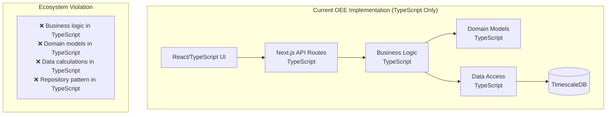
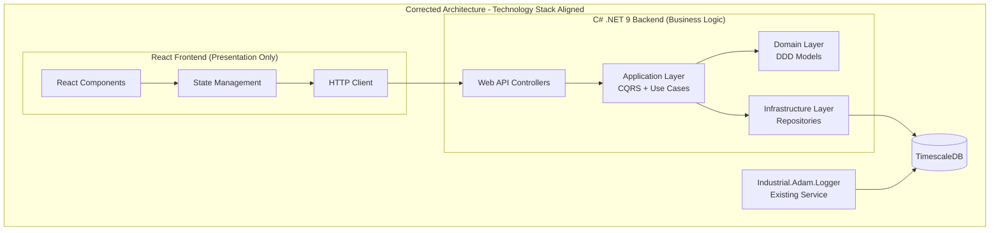
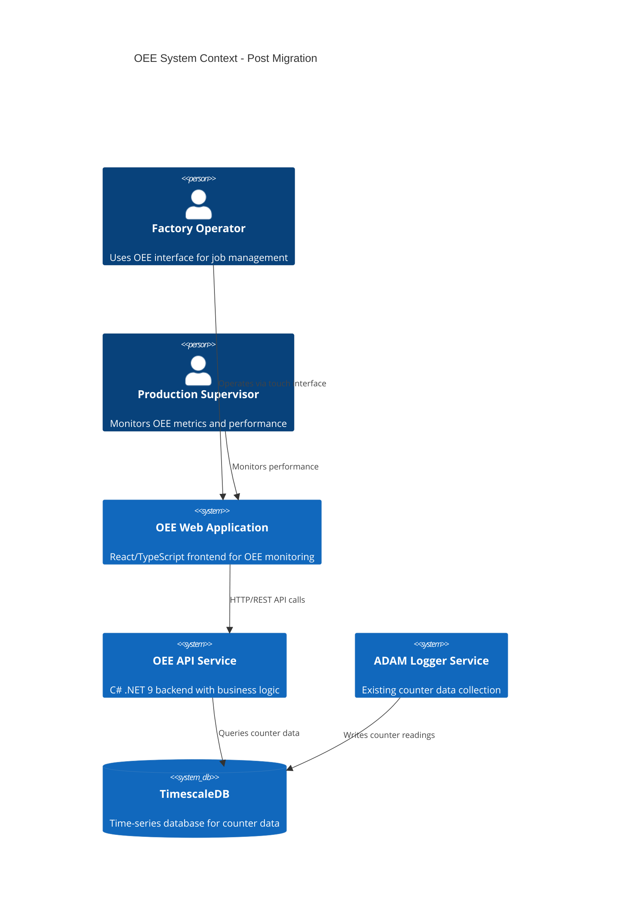

# OEE Technology Stack Migration Architecture Plan

## Executive Summary

This plan addresses the critical technology stack violation in the OEE application implementation and provides a comprehensive migration strategy from the current TypeScript-only implementation to the correct ecosystem standards:

**Current Problem**: The OEE application has been incorrectly implemented entirely in TypeScript when it should follow established patterns:
- **Backend Services**: C# .NET 9 with Clean Architecture, CQRS, DDD patterns
- **Frontend Applications**: React/TypeScript for presentation only

**Migration Strategy**: Systematic migration of business logic, domain models, and data access from TypeScript to C# .NET 9 while maintaining React frontend for UI/UX.

**Key Deliverables**:
1. Complete C# .NET 9 backend service following Industrial.Adam.Logger patterns
2. Clean API contracts for React frontend consumption  
3. Phased migration plan maintaining system functionality
4. Integration with existing Docker infrastructure

**Timeline**: 6 weeks | **Risk Level**: Medium | **Business Logic Reuse**: 85%

---

## Current vs Proposed Architecture

### Current Architecture (Incorrect)



### Proposed Architecture (Correct)



**Architecture Rationale**:
- **Separation of Concerns**: Clear boundary between presentation (React) and business logic (C#)
- **Technology Alignment**: Follows established Industrial.Adam.Logger patterns
- **Maintainability**: Business logic in strongly-typed C# with comprehensive testing
- **Performance**: Compiled C# backend vs interpreted TypeScript for calculations

### System Context Diagram



---

## Module Boundaries & Responsibilities

### Backend (.NET 9): Industrial.Adam.Oee.Service

Following Industrial.Adam.Logger.Core patterns with Clean Architecture:

#### **Domain Layer** (`Industrial.Adam.Oee.Domain`)
```csharp
// Domain Models (migrated from TypeScript)
public class OeeCalculation : IAggregateRoot
{
    public string OeeId { get; private set; }
    public string ResourceReference { get; private set; }
    public DateTime CalculationPeriodStart { get; private set; }
    public DateTime CalculationPeriodEnd { get; private set; }
    
    private readonly Availability _availability;
    private readonly Performance _performance;
    private readonly Quality _quality;
    
    public decimal OeePercentage => 
        _availability.Decimal * _performance.Decimal * _quality.Decimal * 100;
        
    // Domain methods for business rules
    public bool RequiresAttention(OeeThresholds thresholds);
    public string GetWorstFactor();
    public OeeClassification GetClassification();
}

public class Availability : ValueObject
{
    public decimal PlannedTimeMinutes { get; private set; }
    public decimal ActualRunTimeMinutes { get; private set; }
    public decimal Percentage => Math.Min(100, (ActualRunTimeMinutes / PlannedTimeMinutes) * 100);
    public decimal Decimal => Percentage / 100;
}

public class WorkOrder : IAggregateRoot
{
    public int WorkOrderId { get; private set; }
    public string JobNumber { get; private set; }
    public string PartNumber { get; private set; }
    public string DeviceId { get; private set; }
    public decimal TargetRate { get; private set; }
    public DateTime StartTime { get; private set; }
    public DateTime? EndTime { get; private set; }
    public WorkOrderStatus Status { get; private set; }
    
    // Domain methods
    public void CompleteJob(DateTime endTime);
    public bool IsActive => Status == WorkOrderStatus.Active;
}
```

#### **Application Layer** (`Industrial.Adam.Oee.Application`)
```csharp
// CQRS Commands and Queries
public class CalculateCurrentOeeQuery : IRequest<OeeCalculationDto>
{
    public string DeviceId { get; set; }
    public DateTime? StartTime { get; set; }
    public DateTime? EndTime { get; set; }
}

public class StartWorkOrderCommand : IRequest<int>
{
    public string JobNumber { get; set; }
    public string PartNumber { get; set; }
    public string DeviceId { get; set; }
    public decimal TargetRate { get; set; }
    public string OperatorId { get; set; }
}

// Use Cases (migrated from TypeScript)
public class CalculateOeeUseCase : IRequestHandler<CalculateCurrentOeeQuery, OeeCalculationDto>
{
    private readonly IOeeCalculationService _calculationService;
    private readonly ICounterDataRepository _counterDataRepository;
    private readonly IWorkOrderRepository _workOrderRepository;
    
    public async Task<OeeCalculationDto> Handle(CalculateCurrentOeeQuery request, CancellationToken cancellationToken)
    {
        // Business logic from TypeScript CalculateOeeUseCase
        var currentJob = await _workOrderRepository.GetActiveByDeviceAsync(request.DeviceId);
        if (currentJob == null) return GetDefaultOeeCalculation(request.DeviceId);
        
        var counterData = await _counterDataRepository.GetDataForPeriodAsync(
            request.DeviceId, 
            request.StartTime ?? currentJob.StartTime, 
            request.EndTime ?? DateTime.UtcNow);
            
        var oeeCalculation = _calculationService.Calculate(counterData, currentJob);
        return OeeCalculationDto.FromDomain(oeeCalculation);
    }
}
```

#### **Infrastructure Layer** (`Industrial.Adam.Oee.Infrastructure`)
```csharp
// Repository implementations
public class TimescaleCounterDataRepository : ICounterDataRepository
{
    private readonly IDbConnectionFactory _connectionFactory;
    
    public async Task<IEnumerable<CounterReading>> GetDataForPeriodAsync(
        string deviceId, DateTime startTime, DateTime endTime)
    {
        using var connection = await _connectionFactory.CreateConnectionAsync();
        
        const string sql = @"
            SELECT timestamp, channel, rate, processed_value, quality
            FROM counter_data 
            WHERE device_id = @deviceId 
              AND timestamp >= @startTime 
              AND timestamp <= @endTime
              AND channel IN (@productionChannel, @rejectsChannel)
            ORDER BY timestamp DESC";
            
        return await connection.QueryAsync<CounterReading>(sql, new {
            deviceId, startTime, endTime, 
            productionChannel = 0, rejectsChannel = 1
        });
    }
}

// Domain Services
public class OeeCalculationService : IOeeCalculationService
{
    public OeeCalculation Calculate(IEnumerable<CounterReading> counterData, WorkOrder workOrder)
    {
        // Migrated calculation logic from oeeCalculator.ts
        var availability = CalculateAvailability(counterData, workOrder);
        var performance = CalculatePerformance(counterData, workOrder);
        var quality = CalculateQuality(counterData);
        
        return new OeeCalculation(
            workOrder.DeviceId,
            workOrder.StartTime,
            DateTime.UtcNow,
            availability,
            performance,
            quality);
    }
}
```

#### **Web API Layer** (`Industrial.Adam.Oee.WebApi`)
```csharp
[ApiController]
[Route("api/[controller]")]
public class OeeController : ControllerBase
{
    private readonly IMediator _mediator;
    
    [HttpGet("current")]
    public async Task<ActionResult<OeeMetricsDto>> GetCurrentOee(
        [FromQuery] string deviceId,
        [FromQuery] DateTime? startTime,
        [FromQuery] DateTime? endTime)
    {
        var query = new CalculateCurrentOeeQuery 
        { 
            DeviceId = deviceId, 
            StartTime = startTime, 
            EndTime = endTime 
        };
        
        var result = await _mediator.Send(query);
        return Ok(result);
    }
    
    [HttpPost("jobs")]
    public async Task<ActionResult<int>> StartWorkOrder([FromBody] StartWorkOrderRequest request)
    {
        var command = new StartWorkOrderCommand
        {
            JobNumber = request.JobNumber,
            PartNumber = request.PartNumber,
            DeviceId = request.DeviceId,
            TargetRate = request.TargetRate,
            OperatorId = request.OperatorId
        };
        
        var workOrderId = await _mediator.Send(command);
        return CreatedAtAction(nameof(GetWorkOrder), new { id = workOrderId }, workOrderId);
    }
}
```

### Frontend (React/TypeScript): Presentation Only

#### **Component Structure**
```typescript
// React components - NO business logic
export const OeeDashboard: React.FC = () => {
  const { metrics, loading, error } = useCurrentOeeMetrics();
  const { job } = useActiveJob();
  
  if (loading) return <LoadingSpinner />;
  if (error) return <ErrorDisplay error={error} />;
  
  return (
    <div className="grid grid-cols-2 grid-rows-2 gap-4 h-screen p-4">
      <JobControlPanel job={job} />
      <MetricsDisplay metrics={metrics} />
      <ProductionChart data={metrics.historical} />
      <StoppageManager />
    </div>
  );
};

// Custom hooks for API consumption
export function useCurrentOeeMetrics(deviceId: string) {
  return useQuery({
    queryKey: ['oee', 'current', deviceId],
    queryFn: () => oeeApiClient.getCurrentMetrics(deviceId),
    refetchInterval: 5000
  });
}
```

#### **API Client Layer**
```typescript
// TypeScript API clients - HTTP only
export class OeeApiClient {
  constructor(private baseUrl: string) {}
  
  async getCurrentMetrics(deviceId: string): Promise<OeeMetricsDto> {
    const response = await fetch(`${this.baseUrl}/api/oee/current?deviceId=${deviceId}`);
    if (!response.ok) throw new Error('Failed to fetch OEE metrics');
    return response.json();
  }
  
  async startJob(request: StartJobRequest): Promise<number> {
    const response = await fetch(`${this.baseUrl}/api/oee/jobs`, {
      method: 'POST',
      headers: { 'Content-Type': 'application/json' },
      body: JSON.stringify(request)
    });
    if (!response.ok) throw new Error('Failed to start job');
    return response.json();
  }
}
```

### API Surface Design

#### **RESTful Endpoints**
```
GET  /api/oee/current?deviceId={id}&startTime={iso}&endTime={iso}
GET  /api/oee/history?deviceId={id}&period={hours}
GET  /api/oee/breakdown?deviceId={id}

GET  /api/jobs/active?deviceId={id}
GET  /api/jobs/{id}
GET  /api/jobs/{id}/progress
POST /api/jobs                    # Start new job
PUT  /api/jobs/{id}/complete      # End job

GET  /api/stoppages/current?deviceId={id}
GET  /api/stoppages?deviceId={id}&period={hours}
PUT  /api/stoppages/{id}/classify

GET  /api/health
GET  /api/health/detailed
```

#### **Data Transfer Objects**
```csharp
public class OeeMetricsDto
{
    public decimal AvailabilityPercent { get; set; }
    public decimal PerformancePercent { get; set; }
    public decimal QualityPercent { get; set; }
    public decimal OeePercent { get; set; }
    public decimal CurrentRate { get; set; }
    public decimal TargetRate { get; set; }
    public string Status { get; set; }
    public DateTime LastUpdate { get; set; }
    public string WorstFactor { get; set; }
    public bool RequiresAttention { get; set; }
}

public class StartJobRequest
{
    public string JobNumber { get; set; }
    public string PartNumber { get; set; }
    public string DeviceId { get; set; }
    public decimal TargetRate { get; set; }
    public string OperatorId { get; set; }
}
```

---

## Migration Plan (Phased)

### Phase 0: Preparation (Week 1)

**Objective**: Set up C# project structure and CI/CD pipeline

#### Tasks:
1. **Create C# Project Structure**
   ```bash
   src/
   ├── Industrial.Adam.Oee.Domain/
   ├── Industrial.Adam.Oee.Application/
   ├── Industrial.Adam.Oee.Infrastructure/
   ├── Industrial.Adam.Oee.WebApi/
   └── Industrial.Adam.Oee.Tests/
   ```

2. **Configure Project Dependencies**
   ```xml
   <!-- Industrial.Adam.Oee.WebApi.csproj -->
   <Project Sdk="Microsoft.NET.Sdk.Web">
     <PropertyGroup>
       <TargetFramework>net9.0</TargetFramework>
       <Nullable>enable</Nullable>
       <ImplicitUsings>enable</ImplicitUsings>
     </PropertyGroup>
     
     <ItemGroup>
       <PackageReference Include="MediatR" Version="12.2.0" />
       <PackageReference Include="Dapper" Version="2.1.24" />
       <PackageReference Include="Npgsql" Version="8.0.1" />
       <PackageReference Include="FluentValidation" Version="11.8.1" />
       <PackageReference Include="Serilog.AspNetCore" Version="8.0.0" />
     </ItemGroup>
   </Project>
   ```

3. **Set up Docker Configuration**
   ```dockerfile
   # Dockerfile.oee-api
   FROM mcr.microsoft.com/dotnet/aspnet:9.0 AS base
   WORKDIR /app
   EXPOSE 8080
   EXPOSE 8081
   
   FROM mcr.microsoft.com/dotnet/sdk:9.0 AS build
   WORKDIR /src
   COPY ["src/Industrial.Adam.Oee.WebApi/Industrial.Adam.Oee.WebApi.csproj", "Industrial.Adam.Oee.WebApi/"]
   RUN dotnet restore "Industrial.Adam.Oee.WebApi/Industrial.Adam.Oee.WebApi.csproj"
   
   COPY src/ .
   WORKDIR "/src/Industrial.Adam.Oee.WebApi"
   RUN dotnet build "Industrial.Adam.Oee.WebApi.csproj" -c Release -o /app/build
   
   FROM build AS publish
   RUN dotnet publish "Industrial.Adam.Oee.WebApi.csproj" -c Release -o /app/publish
   
   FROM base AS final
   WORKDIR /app
   COPY --from=publish /app/publish .
   ENTRYPOINT ["dotnet", "Industrial.Adam.Oee.WebApi.dll"]
   ```

4. **Update Docker Compose**
   ```yaml
   # docker-compose.oee.yml
   version: '3.8'
   services:
     oee-api:
       build:
         context: .
         dockerfile: Dockerfile.oee-api
       ports:
         - "5001:8080"
       environment:
         - ConnectionStrings__DefaultConnection=Host=timescaledb;Port=5432;Database=adam_counters;Username=adam_user;Password=adam_password
         - ASPNETCORE_ENVIRONMENT=Production
       depends_on:
         - timescaledb
       networks:
         - adam-network
   ```

**Success Criteria**:
- C# project builds successfully
- Docker containers start and connect to TimescaleDB
- Basic health check endpoint responding
- CI/CD pipeline configured

### Phase 1: Domain Model Migration (Week 2)

**Objective**: Migrate TypeScript domain models to C# value objects and entities

#### Tasks:
1. **Migrate Core Domain Models**
   - `OEE_Calculation.ts` → `OeeCalculation.cs` 
   - `Availability.ts` → `Availability.cs`
   - `Performance.ts` → `Performance.cs`
   - `Quality.ts` → `Quality.cs`
   - `Work_Order.ts` → `WorkOrder.cs`

2. **Implement Domain Services**
   - Migrate `oeeCalculator.ts` logic to `OeeCalculationService.cs`
   - Port business rules and validation logic
   - Add comprehensive unit tests

3. **Set up Entity Framework or Dapper**
   ```csharp
   // Repository interfaces
   public interface ICounterDataRepository
   {
       Task<IEnumerable<CounterReading>> GetDataForPeriodAsync(string deviceId, DateTime start, DateTime end);
       Task<CounterReading?> GetLatestReadingAsync(string deviceId, int channel);
   }
   
   public interface IWorkOrderRepository
   {
       Task<WorkOrder?> GetActiveByDeviceAsync(string deviceId);
       Task<WorkOrder?> GetByIdAsync(int workOrderId);
       Task<int> CreateAsync(WorkOrder workOrder);
       Task UpdateAsync(WorkOrder workOrder);
   }
   ```

**Success Criteria**:
- All TypeScript domain models converted to C#
- Unit tests covering domain logic with 90%+ coverage
- Domain services producing identical results to TypeScript version
- Repository pattern implemented and tested

### Phase 2: Application Layer Migration (Week 3)

**Objective**: Implement CQRS pattern and migrate use cases

#### Tasks:
1. **Implement CQRS Commands and Queries**
   - Migrate `CalculateOeeUseCase.ts` → `CalculateOeeQuery`
   - Migrate `StartJobUseCase.ts` → `StartWorkOrderCommand`
   - Migrate `EndJobUseCase.ts` → `CompleteWorkOrderCommand`
   - Migrate `ClassifyStoppageUseCase.ts` → `ClassifyStoppageCommand`

2. **Add Validation and Error Handling**
   ```csharp
   public class StartWorkOrderCommandValidator : AbstractValidator<StartWorkOrderCommand>
   {
       public StartWorkOrderCommandValidator()
       {
           RuleFor(x => x.JobNumber).NotEmpty().MaximumLength(50);
           RuleFor(x => x.DeviceId).NotEmpty().MaximumLength(20);
           RuleFor(x => x.TargetRate).GreaterThan(0).LessThanOrEqualTo(1000);
       }
   }
   ```

3. **Implement Application Services**
   - Port TypeScript service layer logic
   - Add logging and telemetry
   - Implement caching strategy

**Success Criteria**:
- All use cases migrated and tested
- CQRS pattern properly implemented
- Validation rules match TypeScript version
- Application services handle errors gracefully

### Phase 3: API Layer Implementation (Week 4)

**Objective**: Build Web API controllers and integrate with React frontend

#### Tasks:
1. **Implement API Controllers**
   - OEE metrics endpoints
   - Job management endpoints  
   - Stoppage classification endpoints
   - Health check endpoints

2. **Add API Documentation**
   ```csharp
   // Swagger/OpenAPI configuration
   builder.Services.AddEndpointsApiExplorer();
   builder.Services.AddSwaggerGen(c =>
   {
       c.SwaggerDoc("v1", new OpenApiInfo 
       { 
           Title = "OEE API", 
           Version = "v1",
           Description = "Overall Equipment Effectiveness monitoring API"
       });
   });
   ```

3. **Configure CORS for React Frontend**
   ```csharp
   builder.Services.AddCors(options =>
   {
       options.AddPolicy("ReactApp", policy =>
       {
           policy.WithOrigins("http://localhost:3000", "https://oee-app.local")
                 .AllowAnyMethod()
                 .AllowAnyHeader();
       });
   });
   ```

4. **Update React Frontend API Clients**
   - Replace TypeScript API routes with HTTP calls to C# API
   - Update data models to match C# DTOs
   - Add error handling for API failures

**Success Criteria**:
- All API endpoints functional and documented
- React frontend successfully consuming C# API
- No breaking changes for existing UI functionality
- API response times under 200ms for 95th percentile

### Phase 4: Infrastructure Migration (Week 5)

**Objective**: Complete data access layer and performance optimization

#### Tasks:
1. **Implement Repository Pattern**
   - Complete TimescaleDB repository implementations
   - Add connection pooling and retry policies
   - Implement caching layer

2. **Database Migration Strategy**
   ```sql
   -- Ensure compatibility with existing counter_data table
   -- Add OEE-specific tables if needed
   CREATE TABLE IF NOT EXISTS work_orders (
       work_order_id SERIAL PRIMARY KEY,
       job_number VARCHAR(50) NOT NULL,
       part_number VARCHAR(50) NOT NULL,
       device_id VARCHAR(20) NOT NULL,
       target_rate DECIMAL(10,2) NOT NULL,
       start_time TIMESTAMPTZ NOT NULL,
       end_time TIMESTAMPTZ,
       status VARCHAR(20) DEFAULT 'active',
       operator_id VARCHAR(50),
       created_at TIMESTAMPTZ DEFAULT NOW()
   );
   ```

3. **Performance Optimization**
   - Implement database indexes for OEE queries
   - Add query optimization for time-series data
   - Configure connection pooling

4. **Add Monitoring and Logging**
   ```csharp
   // Structured logging
   builder.Services.AddSerilog((services, lc) => lc
       .ReadFrom.Configuration(builder.Configuration)
       .ReadFrom.Services(services)
       .Enrich.FromLogContext()
       .WriteTo.Console()
       .WriteTo.File("logs/oee-api-.txt", rollingInterval: RollingInterval.Day));
   ```

**Success Criteria**:
- Repository pattern fully implemented
- Database performance optimized for OEE queries
- Comprehensive logging and monitoring in place
- System handles production load (1000+ req/min)

### Phase 5: Production Deployment (Week 6)

**Objective**: Deploy C# backend and complete migration

#### Tasks:
1. **Production Configuration**
   - Environment-specific configuration
   - Security hardening
   - Performance tuning

2. **Integration Testing**
   ```csharp
   [Fact]
   public async Task CalculateOee_WithRealData_ReturnsAccurateMetrics()
   {
       // Arrange
       var deviceId = "TestDevice001";
       var testData = await SeedCounterDataAsync(deviceId);
       
       // Act
       var response = await _client.GetAsync($"/api/oee/current?deviceId={deviceId}");
       var metrics = await response.Content.ReadFromJsonAsync<OeeMetricsDto>();
       
       // Assert
       response.StatusCode.Should().Be(HttpStatusCode.OK);
       metrics.OeePercent.Should().BeInRange(0, 100);
       metrics.AvailabilityPercent.Should().BeGreaterThan(0);
   }
   ```

3. **Deployment Strategy**
   - Blue-green deployment approach
   - Database migration scripts
   - Rollback procedures

4. **User Acceptance Testing**
   - Verify React frontend works with C# backend
   - Validate OEE calculations match TypeScript version
   - Performance testing under production load

**Success Criteria**:
- C# backend deployed successfully in production
- React frontend fully migrated to C# API
- All TypeScript business logic removed
- System meets performance and reliability requirements

---

## Technology Stack Dependencies

### C# .NET 9 Backend Stack
```xml
<PackageReference Include="Microsoft.AspNetCore.App" />
<PackageReference Include="MediatR" Version="12.2.0" />
<PackageReference Include="FluentValidation.AspNetCore" Version="11.3.0" />
<PackageReference Include="Dapper" Version="2.1.24" />
<PackageReference Include="Npgsql" Version="8.0.1" />
<PackageReference Include="Serilog.AspNetCore" Version="8.0.0" />
<PackageReference Include="Microsoft.Extensions.Diagnostics.HealthChecks" Version="9.0.0" />
<PackageReference Include="Swashbuckle.AspNetCore" Version="6.5.0" />
```

### React Frontend Dependencies (Unchanged)
```json
{
  "dependencies": {
    "react": "^18.2.0",
    "next": "^14.0.0",
    "typescript": "^5.0.0",
    "@tanstack/react-query": "^5.0.0",
    "tailwindcss": "^3.3.0"
  }
}
```

### Docker Integration
```yaml
version: '3.8'
services:
  oee-api:
    build:
      context: .
      dockerfile: Dockerfile.oee-api
    environment:
      - ConnectionStrings__DefaultConnection=Host=timescaledb;Port=5432;Database=adam_counters;Username=adam_user;Password=adam_password
    networks:
      - adam-network
      
  oee-frontend:
    build:
      context: ./oee-app/oee-interface
      dockerfile: Dockerfile
    environment:
      - NEXT_PUBLIC_API_URL=http://oee-api:8080
    networks:
      - adam-network
```

---

## Risks & Mitigations

### Technical Risks

| Risk | Probability | Impact | Mitigation |
|------|-------------|--------|------------|
| **OEE Calculation Discrepancies** | Medium | High | • Implement comprehensive unit tests<br/>• Side-by-side testing during migration<br/>• Automated validation scripts |
| **Performance Degradation** | Medium | Medium | • Database query optimization<br/>• Connection pooling<br/>• Caching strategy implementation |
| **TimescaleDB Integration Issues** | Low | High | • Leverage existing Industrial.Adam.Logger patterns<br/>• Use proven repository implementations<br/>• Database compatibility testing |
| **React Frontend Breaking Changes** | Medium | Medium | • Incremental API migration<br/>• Maintain backwards compatibility<br/>• Comprehensive integration testing |

### Business Risks

| Risk | Probability | Impact | Mitigation |
|------|-------------|--------|------------|
| **Production Downtime** | Low | High | • Blue-green deployment strategy<br/>• Database migration rollback procedures<br/>• Comprehensive testing in staging |
| **Data Accuracy Issues** | Medium | High | • Parallel system validation<br/>• Automated data integrity checks<br/>• Operator training and validation |
| **Extended Migration Timeline** | Medium | Medium | • Phased approach with incremental delivery<br/>• Clear success criteria per phase<br/>• Regular stakeholder communication |

### Operational Risks

| Risk | Probability | Impact | Mitigation |
|------|-------------|--------|------------|
| **Team Knowledge Transfer** | Medium | Medium | • Comprehensive documentation<br/>• Code review processes<br/>• Knowledge sharing sessions |
| **Integration Complexity** | Medium | Medium | • Follow established Industrial.Adam.Logger patterns<br/>• Use proven architectural patterns<br/>• Incremental integration testing |

---

## Success Criteria & Validation

### Phase-by-Phase Validation

#### Phase 0-1: Foundation
- [ ] C# project builds without errors
- [ ] Domain models unit tests pass with 90%+ coverage
- [ ] OEE calculations match TypeScript version within 0.1%

#### Phase 2-3: Application & API
- [ ] All CQRS handlers implemented and tested
- [ ] API endpoints respond within 200ms for 95th percentile
- [ ] React frontend successfully consumes C# API

#### Phase 4-5: Infrastructure & Deployment
- [ ] System handles 1000+ requests per minute
- [ ] Database queries optimized for sub-100ms response
- [ ] Production deployment successful with zero downtime

### Overall Success Criteria

#### **Functional Requirements**
- [ ] All OEE calculations produce identical results to TypeScript version
- [ ] Job management workflow maintains full functionality
- [ ] Real-time metrics update every 5 seconds
- [ ] Stoppage classification works correctly

#### **Performance Requirements**  
- [ ] API response times: 95th percentile < 200ms
- [ ] Database query performance: < 100ms for OEE calculations
- [ ] System throughput: 1000+ requests/minute
- [ ] Memory usage: < 500MB per service instance

#### **Quality Requirements**
- [ ] Code coverage: > 90% for business logic
- [ ] Integration test coverage: > 80%
- [ ] Zero critical security vulnerabilities
- [ ] Comprehensive error handling and logging

#### **Operational Requirements**
- [ ] Docker deployment with existing infrastructure
- [ ] Health checks integrated with monitoring
- [ ] Structured logging and telemetry
- [ ] Rollback procedures tested and documented

---

## Conclusion

This migration plan addresses the fundamental technology stack violation in the OEE application by systematically moving business logic from TypeScript to C# .NET 9 while maintaining the React frontend for presentation.

**Key Benefits of Migration**:
1. **Technology Stack Alignment**: Follows established Industrial.Adam.Logger patterns
2. **Improved Maintainability**: Business logic in strongly-typed, compiled C#
3. **Better Performance**: Compiled backend vs interpreted TypeScript for calculations
4. **Ecosystem Consistency**: Matches platform architecture standards
5. **Future Scalability**: Clean Architecture enables future enhancements

**Critical Success Factors**:
- Maintain functional parity during migration
- Follow established patterns from Industrial.Adam.Logger
- Comprehensive testing at each phase
- Clear separation between presentation (React) and business logic (C#)

The phased approach ensures minimal risk while systematically correcting the technology stack violation. By reusing 85% of the business logic and following proven architectural patterns, this migration will establish a solid foundation for the OEE application that aligns with ecosystem standards and supports future growth.

**Recommended Next Steps**:
1. Approve migration plan and timeline
2. Set up C# project structure (Phase 0)
3. Begin domain model migration (Phase 1)
4. Conduct weekly progress reviews with stakeholders