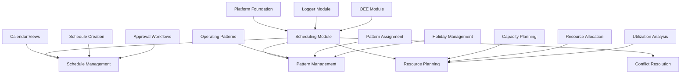
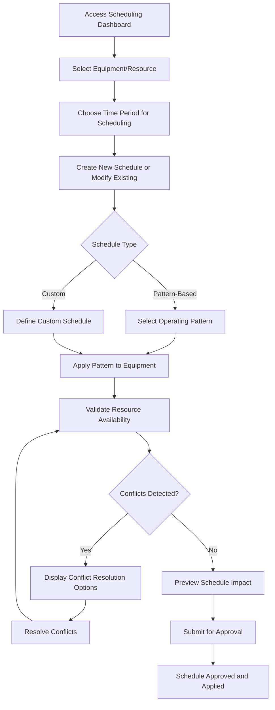
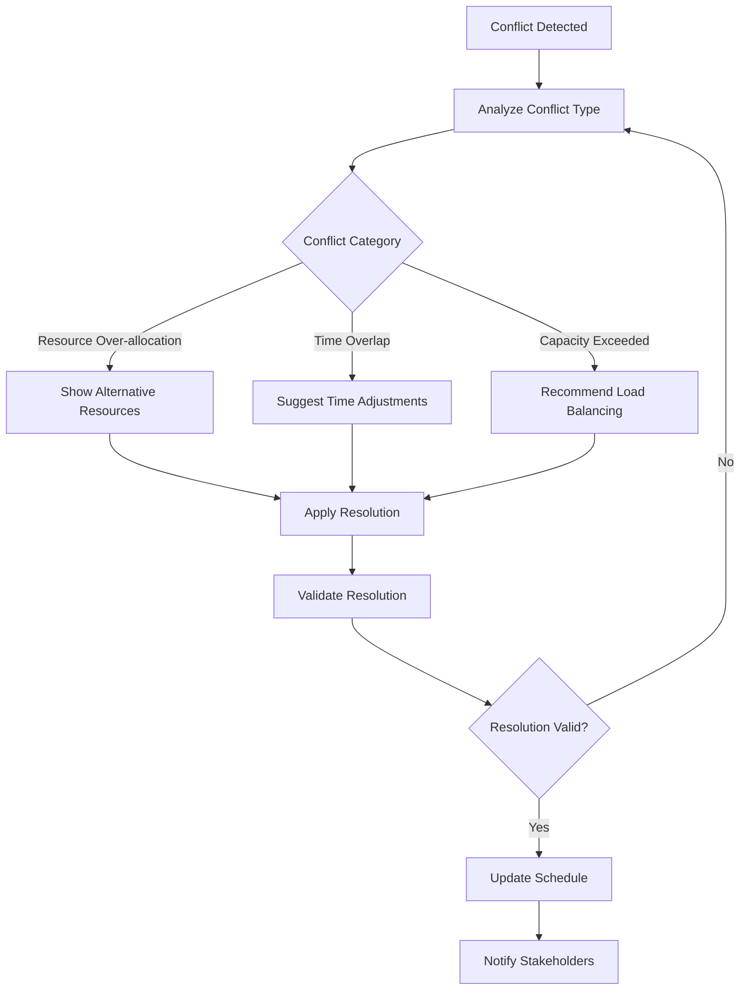

# Equipment Scheduling Module Frontend Design Specification
**Industrial ADAM Equipment Scheduling - Detailed Design Implementation**

**Version**: 1.0  
**Date**: August 27, 2025  
**Status**: Implementation Ready  
**Priority**: Medium - Advanced Production Planning Module

---

## 1. Executive Summary

### Design Mission
The Equipment Scheduling Module Frontend provides comprehensive interfaces for managing ISA-95 compliant equipment scheduling, operating pattern management, and resource availability planning within the Industrial ADAM platform. This specification transforms the Scheduling Module PRD requirements into detailed, implementation-ready frontend designs following the established platform design system while serving the specialized needs of production planning and resource optimization.

### Design Principles
- **Production Planning Excellence**: Optimized workflows for production planners and supervisors
- **ISA-95 Compliance**: Full adherence to industrial hierarchy and resource modeling standards
- **Real-Time Resource Visibility**: Immediate insight into equipment availability and conflicts
- **Schedule Optimization Focus**: Clear visualization of schedule efficiency and conflict resolution
- **OEE Integration**: Seamless integration with OEE planned availability calculations

### Module Integration Context


---

## 2. User Experience Flows and Personas

### 2.1 Production Planning Focused User Personas

#### Production Planner (Primary User)
```typescript
interface ProductionPlannerPersona {
  role: 'Supervisor' | 'Manager';
  primaryGoals: [
    'Create efficient equipment schedules across production lines',
    'Optimize resource utilization and minimize conflicts',
    'Manage operating patterns and holiday exceptions',
    'Coordinate with OEE targets for production planning'
  ];
  interfaceNeeds: {
    dashboardStyle: 'calendar-and-timeline-focused';
    planningHorizon: 'weekly-monthly-quarterly';
    conflictVisibility: 'immediate-visual-indicators';
    dragDropInteraction: 'intuitive-schedule-editing';
  };
  permissions: ['MANAGE_SCHEDULES', 'CREATE_PATTERNS', 'VIEW_RESOURCE_CONFLICTS'];
}
```

#### Resource Manager (Capacity Planning User)
```typescript
interface ResourceManagerPersona {
  role: 'Manager';
  primaryGoals: [
    'Monitor equipment capacity utilization across facilities',
    'Identify bottlenecks and optimization opportunities',
    'Plan resource allocation for future production',
    'Analyze schedule efficiency and performance'
  ];
  interfaceNeeds: {
    displayStyle: 'analytical-charts-and-metrics';
    dataAggregation: 'multi-equipment-hierarchy-view';
    reportingTools: 'capacity-utilization-analysis';
    planningTools: 'scenario-modeling-capabilities';
  };
  permissions: ['VIEW_ALL_SCHEDULES', 'ANALYZE_CAPACITY', 'EXPORT_REPORTS'];
}
```

#### Equipment Operator (Schedule Monitoring User)
```typescript
interface EquipmentOperatorPersona {
  role: 'Operator';
  primaryGoals: [
    'View current and upcoming equipment schedules',
    'Report schedule adherence and deviations',
    'Update work order progress for schedule tracking',
    'Receive schedule change notifications'
  ];
  interfaceNeeds: {
    displayStyle: 'simple-current-schedule-focus';
    complexity: 'read-only-with-status-updates';
    interactions: 'touch-friendly-status-reporting';
    notifications: 'clear-schedule-change-alerts';
  };
  permissions: ['VIEW_SCHEDULES', 'UPDATE_STATUS', 'RECEIVE_NOTIFICATIONS'];
}
```

### 2.2 Equipment Scheduling Workflow Patterns

#### Schedule Creation and Management Flow


#### Resource Conflict Resolution Flow


---

## 3. Information Architecture and Screen Layouts

### 3.1 Scheduling Module Navigation Structure

#### Module Route Integration
```typescript
const SchedulingModuleRoutes = {
  basePath: '/scheduling',
  routes: [
    {
      path: '/scheduling/dashboard',
      component: 'SchedulingDashboard',
      permissions: ['VIEW_SCHEDULES'],
      layout: 'calendar-optimized',
      title: 'Schedule Management Dashboard'
    },
    {
      path: '/scheduling/calendar',
      component: 'ScheduleCalendarView',
      permissions: ['VIEW_SCHEDULES'],
      layout: 'full-screen-calendar',
      title: 'Equipment Schedule Calendar'
    },
    {
      path: '/scheduling/timeline',
      component: 'ScheduleTimelineView',
      permissions: ['VIEW_SCHEDULES'],
      layout: 'full-screen-timeline',
      title: 'Resource Timeline View'
    },
    {
      path: '/scheduling/patterns',
      component: 'OperatingPatternManagement',
      permissions: ['MANAGE_PATTERNS'],
      layout: 'pattern-management',
      title: 'Operating Pattern Management'
    },
    {
      path: '/scheduling/resources',
      component: 'ResourceCapacityPlanning',
      permissions: ['VIEW_RESOURCES'],
      layout: 'resource-analytics',
      title: 'Resource Capacity Planning'
    },
    {
      path: '/scheduling/conflicts',
      component: 'ConflictResolutionCenter',
      permissions: ['RESOLVE_CONFLICTS'],
      layout: 'conflict-management',
      title: 'Schedule Conflict Resolution'
    },
    {
      path: '/scheduling/analytics',
      component: 'SchedulingAnalytics',
      permissions: ['VIEW_ANALYTICS'],
      layout: 'advanced-analytics',
      title: 'Scheduling Analytics & Optimization'
    }
  ]
};
```

### 3.2 Screen Layout Specifications

#### 3.2.1 Scheduling Dashboard (Primary Landing)

**Layout Pattern**: Multi-view dashboard adaptable to calendar, timeline, and analytics modes

```typescript
interface SchedulingDashboardLayout {
  // Production Planner View (Schedule Creation Focus)
  planner: {
    layout: 'calendar-primary-with-sidebar';
    mainArea: {
      component: 'ScheduleCalendarGrid';
      features: ['drag-drop-scheduling', 'multi-equipment-view', 'conflict-indicators'];
      viewModes: ['day', 'week', 'month', 'quarter'];
      size: '70%';
    };
    sidebar: {
      component: 'SchedulingControlPanel';
      sections: [
        'equipment-selector',
        'pattern-library', 
        'conflict-alerts',
        'schedule-templates'
      ];
      size: '30%';
    };
    footer: {
      component: 'ScheduleActionBar';
      actions: ['create-schedule', 'apply-pattern', 'resolve-conflicts', 'export-view'];
    };
  };

  // Resource Manager View (Capacity Analysis Focus)  
  manager: {
    layout: 'analytics-dashboard-grid';
    topRow: {
      component: 'ResourceUtilizationOverview';
      height: '25%';
      features: ['capacity-metrics', 'bottleneck-indicators', 'efficiency-kpis'];
    };
    mainContent: {
      component: 'CapacityPlanningView';
      height: '50%';
      features: ['gantt-charts', 'utilization-heatmaps', 'scenario-modeling'];
    };
    rightPanel: {
      component: 'OptimizationInsights';
      width: '25%';
      features: ['improvement-recommendations', 'conflict-summary', 'performance-trends'];
    };
    bottomRow: {
      component: 'SchedulePerformanceMetrics';
      height: '25%';
      features: ['schedule-adherence', 'resource-efficiency', 'oee-integration'];
    };
  };

  // Operator View (Current Schedule Focus)
  operator: {
    layout: 'simple-current-schedule';
    sections: [
      {
        component: 'CurrentEquipmentSchedule';
        priority: 'critical';
        size: 'large';
        features: ['current-status', 'upcoming-activities', 'progress-tracking'];
      },
      {
        component: 'ScheduleChangeNotifications';
        priority: 'high';
        size: 'medium';
        features: ['change-alerts', 'acknowledgment-buttons', 'impact-summary'];
      },
      {
        component: 'WorkOrderIntegration';
        priority: 'medium';
        size: 'summary';
        features: ['linked-work-orders', 'completion-status', 'schedule-impact'];
      }
    ];
  };
}
```

#### 3.2.2 Schedule Calendar View (Full-Screen Scheduling)

**Component Architecture**:
```typescript
interface ScheduleCalendarViewLayout {
  header: {
    component: 'CalendarViewHeader';
    elements: {
      navigation: 'CalendarNavigation'; // Previous/Next, Today button
      viewSelector: 'ViewModeToggle'; // Day, Week, Month, Year
      equipmentFilter: 'EquipmentHierarchyFilter';
      timeZoneSelector: 'TimeZoneControls';
    };
  };
  
  toolbar: {
    component: 'SchedulingToolbar';
    tools: [
      'create-schedule-wizard',
      'pattern-application-tool',
      'bulk-schedule-operations',
      'conflict-resolution-center',
      'schedule-templates'
    ];
  };
  
  calendar: {
    component: 'InteractiveScheduleCalendar';
    features: [
      'drag-drop-schedule-creation',
      'real-time-conflict-detection',
      'multi-equipment-lane-view',
      'color-coded-schedule-blocks',
      'hover-preview-details'
    ];
    interactions: [
      'click-to-create-schedule',
      'drag-to-reschedule',
      'right-click-context-menu',
      'selection-for-bulk-operations'
    ];
  };
  
  detailPanel: {
    component: 'ScheduleDetailPanel';
    trigger: 'schedule-block-selection';
    sections: [
      'schedule-information',
      'resource-allocation',
      'pattern-details',
      'conflict-status',
      'oee-impact',
      'approval-workflow'
    ];
  };
}
```

#### 3.2.3 Operating Pattern Management Interface

**Layout Pattern**: Split-screen pattern library and pattern editor
```typescript
interface PatternManagementLayout {
  header: {
    component: 'PatternManagementHeader';
    elements: {
      title: 'Operating Pattern Management';
      patternCount: 'PatternLibraryStats';
      actions: ['create-pattern', 'import-patterns', 'export-library'];
      search: 'PatternSearchFilter';
    };
  };
  
  main: {
    layout: 'split-panel-pattern-management';
    leftPanel: {
      component: 'PatternLibraryBrowser';
      width: '40%';
      features: [
        'pattern-category-tree',
        'pattern-preview-cards',
        'usage-indicators',
        'template-actions'
      ];
      sections: [
        'standard-patterns', // 24/7, Two-Shift, One-Shift
        'custom-patterns',
        'imported-templates',
        'favorites'
      ];
    };
    rightPanel: {
      component: 'PatternEditor';
      width: '60%';
      features: [
        'visual-pattern-builder',
        'shift-timeline-editor',
        'holiday-exception-manager',
        'pattern-validation',
        'preview-generator'
      ];
      modes: ['create', 'edit', 'copy', 'preview'];
    };
  };
  
  footer: {
    component: 'PatternAssignmentPanel';
    features: [
      'equipment-assignment-tree',
      'bulk-assignment-tools',
      'assignment-validation',
      'effective-date-management'
    ];
  };
}
```

---

## 4. Component Specifications

### 4.1 Core Scheduling Display Components

#### 4.1.1 ScheduleCalendarGrid Component

```typescript
interface ScheduleCalendarGridProps {
  // Data
  schedules: Schedule[];
  equipment: EquipmentHierarchyNode[];
  timeRange: {
    start: Date;
    end: Date;
    viewMode: 'day' | 'week' | 'month' | 'quarter';
  };
  
  // Display configuration
  showConflicts?: boolean;
  showPatternInfo?: boolean;
  colorScheme?: 'equipment' | 'pattern' | 'status';
  
  // Interaction settings
  dragDropEnabled?: boolean;
  conflictResolutionMode?: boolean;
  
  // Event handlers
  onScheduleCreate?: (schedule: CreateScheduleRequest) => void;
  onScheduleUpdate?: (scheduleId: string, updates: Partial<Schedule>) => void;
  onScheduleDelete?: (scheduleId: string) => void;
  onConflictDetected?: (conflicts: ScheduleConflict[]) => void;
  onTimeRangeChange?: (timeRange: TimeRange) => void;
  
  className?: string;
}

const ScheduleCalendarGrid = memo(({
  schedules,
  equipment,
  timeRange,
  showConflicts = true,
  showPatternInfo = true,
  colorScheme = 'equipment',
  dragDropEnabled = true,
  conflictResolutionMode = false,
  onScheduleCreate,
  onScheduleUpdate,
  onScheduleDelete,
  onConflictDetected,
  onTimeRangeChange,
  className
}: ScheduleCalendarGridProps) => {
  const [selectedSchedule, setSelectedSchedule] = useState<Schedule | null>(null);
  const [draggedSchedule, setDraggedSchedule] = useState<Schedule | null>(null);
  const [conflicts, setConflicts] = useState<ScheduleConflict[]>([]);
  const calendarRef = useRef<FullCalendarApi | null>(null);
  
  // Real-time conflict detection
  const { detectConflicts } = useScheduleConflictDetection();
  
  // FullCalendar configuration for equipment scheduling
  const calendarConfig = useMemo(() => ({
    plugins: [dayGridPlugin, timeGridPlugin, interactionPlugin, resourceTimeGridPlugin],
    
    // View configuration
    initialView: getFullCalendarView(timeRange.viewMode),
    headerToolbar: {
      left: '',    // Controlled by external header
      center: '',  // Controlled by external header  
      right: ''    // Controlled by external header
    },
    
    // Resource configuration (equipment hierarchy)
    resources: equipment.map(eq => ({
      id: eq.id,
      title: eq.name,
      groupId: eq.parentId,
      eventColor: getEquipmentColor(eq.id),
      extendedProps: {
        type: eq.type,
        location: eq.location,
        capacity: eq.capacity
      }
    })),
    
    // Event configuration (schedules)
    events: schedules.map(schedule => ({
      id: schedule.id,
      resourceId: schedule.equipmentId,
      title: getScheduleTitle(schedule),
      start: schedule.startTime,
      end: schedule.endTime,
      backgroundColor: getScheduleColor(schedule, colorScheme),
      borderColor: schedule.conflicts?.length > 0 ? '#dc2626' : undefined,
      classNames: [
        'schedule-event',
        `schedule-${schedule.status}`,
        schedule.conflicts?.length > 0 ? 'schedule-conflict' : ''
      ],
      extendedProps: {
        schedule,
        patternInfo: schedule.pattern,
        conflicts: schedule.conflicts
      }
    })),
    
    // Interaction configuration
    selectable: dragDropEnabled,
    editable: dragDropEnabled,
    droppable: dragDropEnabled,
    selectMirror: true,
    
    // Event handlers
    select: (selectInfo: DateSelectArg) => {
      if (onScheduleCreate && !conflictResolutionMode) {
        const createRequest: CreateScheduleRequest = {
          equipmentId: selectInfo.resource?.id || '',
          startTime: selectInfo.start,
          endTime: selectInfo.end,
          patternId: null, // Will be set in creation wizard
          priority: 'medium'
        };
        onScheduleCreate(createRequest);
      }
      calendarRef.current?.unselect();
    },
    
    eventClick: (clickInfo: EventClickArg) => {
      const schedule = clickInfo.event.extendedProps.schedule as Schedule;
      setSelectedSchedule(schedule);
    },
    
    eventChange: async (changeInfo: EventChangeArg) => {
      if (onScheduleUpdate) {
        const schedule = changeInfo.event.extendedProps.schedule as Schedule;
        const updates: Partial<Schedule> = {
          startTime: changeInfo.event.start!,
          endTime: changeInfo.event.end!,
          equipmentId: changeInfo.event.getResources()[0]?.id || schedule.equipmentId
        };
        
        // Check for conflicts before applying update
        const newConflicts = await detectConflicts(schedule.id, updates);
        if (newConflicts.length > 0 && !conflictResolutionMode) {
          // Revert change and show conflict dialog
          changeInfo.revert();
          onConflictDetected?.(newConflicts);
        } else {
          onScheduleUpdate(schedule.id, updates);
        }
      }
    },
    
    eventDrop: (dropInfo: EventDropArg) => {
      // Handled by eventChange
    },
    
    eventResize: (resizeInfo: EventResizeArg) => {
      // Handled by eventChange  
    },
    
    // Custom rendering
    eventContent: (eventInfo: EventContentArg) => {
      const schedule = eventInfo.event.extendedProps.schedule as Schedule;
      
      return (
        <div className="schedule-event-content">
          <div className="schedule-title">{eventInfo.event.title}</div>
          
          {showPatternInfo && schedule.pattern && (
            <div className="schedule-pattern">
              <Badge variant="outline" className="text-xs">
                {schedule.pattern.name}
              </Badge>
            </div>
          )}
          
          {showConflicts && schedule.conflicts && schedule.conflicts.length > 0 && (
            <div className="schedule-conflicts">
              <AlertTriangle className="w-3 h-3 text-red-600" />
              <span className="text-xs text-red-600">
                {schedule.conflicts.length} conflict(s)
              </span>
            </div>
          )}
          
          <div className="schedule-meta text-xs text-neutral-600">
            {formatScheduleDuration(schedule.startTime, schedule.endTime)}
          </div>
        </div>
      );
    },
    
    // Styling
    height: 'auto',
    aspectRatio: 1.8,
    expandRows: true,
    stickyHeaderDates: true,
    
    // Time configuration
    slotMinTime: '00:00:00',
    slotMaxTime: '24:00:00',
    slotDuration: '01:00:00',
    snapDuration: '00:15:00',
    
    // Business hours (can be overridden by patterns)
    businessHours: {
      daysOfWeek: [1, 2, 3, 4, 5], // Monday - Friday
      startTime: '06:00',
      endTime: '18:00'
    }
  }), [
    equipment, 
    schedules, 
    timeRange, 
    showConflicts, 
    showPatternInfo, 
    colorScheme,
    dragDropEnabled,
    conflictResolutionMode,
    onScheduleCreate,
    onScheduleUpdate,
    detectConflicts,
    onConflictDetected
  ]);
  
  // Initialize calendar
  useEffect(() => {
    if (calendarRef.current) {
      calendarRef.current.gotoDate(timeRange.start);
      calendarRef.current.changeView(getFullCalendarView(timeRange.viewMode));
    }
  }, [timeRange]);
  
  return (
    <div className={cn('schedule-calendar-grid', className)}>
      {/* Conflict Alert Bar */}
      {conflicts.length > 0 && (
        <div className="conflict-alert-bar bg-red-50 border-l-4 border-l-red-500 p-4 mb-4">
          <div className="flex items-center">
            <AlertTriangle className="w-5 h-5 text-red-600 mr-2" />
            <div>
              <h4 className="font-semibold text-red-900">
                {conflicts.length} Schedule Conflict{conflicts.length > 1 ? 's' : ''} Detected
              </h4>
              <p className="text-sm text-red-700">
                Review and resolve conflicts before proceeding with schedule changes.
              </p>
            </div>
            <Button
              size="sm"
              onClick={() => setConflictResolutionMode(true)}
              className="ml-auto"
            >
              Resolve Conflicts
            </Button>
          </div>
        </div>
      )}
      
      {/* Calendar Component */}
      <div className="calendar-container">
        <FullCalendar
          ref={calendarRef}
          {...calendarConfig}
        />
      </div>
      
      {/* Schedule Detail Modal */}
      {selectedSchedule && (
        <ScheduleDetailModal
          schedule={selectedSchedule}
          isOpen={!!selectedSchedule}
          onClose={() => setSelectedSchedule(null)}
          onUpdate={onScheduleUpdate}
          onDelete={onScheduleDelete}
        />
      )}
      
      {/* Conflict Resolution Panel */}
      {conflictResolutionMode && (
        <ConflictResolutionPanel
          conflicts={conflicts}
          onResolve={(resolution) => {
            // Apply conflict resolution
            setConflicts([]);
            setConflictResolutionMode(false);
          }}
          onCancel={() => setConflictResolutionMode(false)}
        />
      )}
    </div>
  );
});

// Utility functions
const getFullCalendarView = (viewMode: string) => {
  const viewMap = {
    day: 'resourceTimeGridDay',
    week: 'resourceTimeGridWeek', 
    month: 'dayGridMonth',
    quarter: 'dayGridMonth' // Will show 3 months
  };
  return viewMap[viewMode] || 'resourceTimeGridWeek';
};

const getScheduleColor = (schedule: Schedule, colorScheme: string) => {
  switch (colorScheme) {
    case 'equipment':
      return getEquipmentColor(schedule.equipmentId);
    case 'pattern':
      return getPatternColor(schedule.pattern?.id);
    case 'status':
      return getStatusColor(schedule.status);
    default:
      return '#3b82f6';
  }
};

const getScheduleTitle = (schedule: Schedule) => {
  if (schedule.workOrderId) {
    return `WO-${schedule.workOrderId}`;
  }
  if (schedule.pattern) {
    return schedule.pattern.name;
  }
  return `Schedule ${schedule.id.slice(-6)}`;
};
```

#### 4.1.2 OperatingPatternCard Component

```typescript
interface OperatingPatternCardProps {
  pattern: {
    id: string;
    name: string;
    type: '24/7' | 'TwoShift' | 'OneShift' | 'Custom';
    description: string;
    shiftDefinitions: ShiftDefinition[];
    holidayHandling: HolidayHandling;
    effectiveDates: DateRange;
    assignmentCount: number;
    efficiency: number;
    createdBy: string;
    lastModified: Date;
  };
  
  // Display options
  showAssignments?: boolean;
  showEfficiency?: boolean;
  showPreview?: boolean;
  
  // Interaction settings
  selectable?: boolean;
  editable?: boolean;
  
  // Event handlers
  onSelect?: (pattern: OperatingPattern) => void;
  onEdit?: (pattern: OperatingPattern) => void;
  onCopy?: (pattern: OperatingPattern) => void;
  onDelete?: (pattern: OperatingPattern) => void;
  onAssign?: (pattern: OperatingPattern) => void;
  onPreview?: (pattern: OperatingPattern) => void;
  
  className?: string;
}

const OperatingPatternCard = memo(({
  pattern,
  showAssignments = true,
  showEfficiency = true,
  showPreview = true,
  selectable = true,
  editable = true,
  onSelect,
  onEdit,
  onCopy,
  onDelete,
  onAssign,
  onPreview,
  className
}: OperatingPatternCardProps) => {
  const patternTypeConfig = getPatternTypeConfig(pattern.type);
  const weeklyHours = calculateWeeklyHours(pattern.shiftDefinitions);
  const utilizationPercentage = (weeklyHours / 168) * 100; // 168 hours per week
  
  return (
    <Card 
      className={cn(
        'pattern-card relative border-l-4 cursor-pointer transition-all duration-200',
        'hover:shadow-lg hover:scale-[1.01]',
        patternTypeConfig.borderColor,
        selectable && 'hover:bg-neutral-50',
        className
      )}
      onClick={() => onSelect?.(pattern)}
    >
      {/* Pattern Type Badge */}
      <div className="absolute top-3 right-3">
        <Badge 
          variant="secondary"
          className={cn(patternTypeConfig.badgeColor)}
        >
          {pattern.type}
        </Badge>
      </div>
      
      {/* Header */}
      <div className="p-4 pb-2">
        <div className="flex items-start justify-between mb-2">
          <div>
            <h3 className="text-lg font-semibold text-neutral-900 pr-16">
              {pattern.name}
            </h3>
            <p className="text-sm text-neutral-600 mt-1">
              {pattern.description}
            </p>
          </div>
        </div>
        
        {/* Pattern Icon and Basic Info */}
        <div className="flex items-center space-x-4 mt-3">
          <div className="flex items-center space-x-2">
            <patternTypeConfig.icon className="w-5 h-5 text-neutral-600" />
            <span className="text-sm font-medium text-neutral-700">
              {pattern.shiftDefinitions.length} shifts
            </span>
          </div>
          <div className="flex items-center space-x-2">
            <Clock className="w-4 h-4 text-neutral-600" />
            <span className="text-sm text-neutral-700">
              {weeklyHours}h/week
            </span>
          </div>
        </div>
      </div>
      
      {/* Weekly Pattern Preview */}
      {showPreview && (
        <div className="px-4 pb-2">
          <div className="text-xs font-medium text-neutral-700 mb-2">
            Weekly Pattern Preview
          </div>
          <div className="grid grid-cols-7 gap-1">
            {['Sun', 'Mon', 'Tue', 'Wed', 'Thu', 'Fri', 'Sat'].map((day, index) => {
              const dayShifts = pattern.shiftDefinitions.filter(shift => 
                shift.daysOfWeek.includes(index)
              );
              
              return (
                <div key={day} className="text-center">
                  <div className="text-xs text-neutral-600 mb-1">{day}</div>
                  <div className="h-12 bg-neutral-100 rounded relative overflow-hidden">
                    {dayShifts.map((shift, shiftIndex) => (
                      <div
                        key={shiftIndex}
                        className={cn(
                          'absolute h-full rounded',
                          shift.isProductionShift 
                            ? 'bg-primary-500' 
                            : 'bg-neutral-400',
                          'opacity-80'
                        )}
                        style={{
                          left: `${(getHourFromTime(shift.startTime) / 24) * 100}%`,
                          width: `${(getShiftDuration(shift) / 24) * 100}%`
                        }}
                        title={`${shift.name}: ${shift.startTime} - ${shift.endTime}`}
                      />
                    ))}
                  </div>
                </div>
              );
            })}
          </div>
        </div>
      )}
      
      {/* Metrics Row */}
      <div className="px-4 pb-2">
        <div className="grid grid-cols-3 gap-4 text-center">
          {showAssignments && (
            <div>
              <div className="text-lg font-bold text-neutral-900">
                {pattern.assignmentCount}
              </div>
              <div className="text-xs text-neutral-600">Assignments</div>
            </div>
          )}
          
          <div>
            <div className="text-lg font-bold text-primary-600">
              {utilizationPercentage.toFixed(0)}%
            </div>
            <div className="text-xs text-neutral-600">Utilization</div>
          </div>
          
          {showEfficiency && (
            <div>
              <div className={cn(
                'text-lg font-bold',
                pattern.efficiency >= 90 ? 'text-status-success' :
                pattern.efficiency >= 75 ? 'text-status-warning' :
                'text-status-error'
              )}>
                {pattern.efficiency.toFixed(1)}%
              </div>
              <div className="text-xs text-neutral-600">Efficiency</div>
            </div>
          )}
        </div>
      </div>
      
      {/* Shift Definitions Summary */}
      <div className="px-4 pb-2">
        <div className="text-xs font-medium text-neutral-700 mb-2">
          Shift Definitions
        </div>
        <div className="space-y-1">
          {pattern.shiftDefinitions.slice(0, 3).map((shift, index) => (
            <div key={index} className="flex items-center justify-between text-xs">
              <span className="font-medium text-neutral-700">
                {shift.name}
              </span>
              <span className="text-neutral-600">
                {shift.startTime} - {shift.endTime}
              </span>
              <Badge 
                variant="outline" 
                className={cn(
                  'text-xs',
                  shift.isProductionShift 
                    ? 'border-green-300 text-green-700' 
                    : 'border-neutral-300 text-neutral-600'
                )}
              >
                {shift.isProductionShift ? 'Production' : 'Maintenance'}
              </Badge>
            </div>
          ))}
          {pattern.shiftDefinitions.length > 3 && (
            <div className="text-xs text-neutral-500 text-center">
              +{pattern.shiftDefinitions.length - 3} more shifts
            </div>
          )}
        </div>
      </div>
      
      {/* Footer with metadata and actions */}
      <div className="border-t bg-neutral-50 px-4 py-3">
        <div className="flex items-center justify-between">
          <div className="text-xs text-neutral-600">
            Modified {formatRelativeTime(pattern.lastModified)} by {pattern.createdBy}
          </div>
          
          <div className="flex space-x-2">
            {onPreview && (
              <Button
                size="xs"
                variant="outline"
                onClick={(e) => {
                  e.stopPropagation();
                  onPreview(pattern);
                }}
              >
                <Eye className="w-3 h-3 mr-1" />
                Preview
              </Button>
            )}
            
            {editable && onEdit && (
              <Button
                size="xs"
                variant="outline"
                onClick={(e) => {
                  e.stopPropagation();
                  onEdit(pattern);
                }}
              >
                <Edit className="w-3 h-3 mr-1" />
                Edit
              </Button>
            )}
            
            {onCopy && (
              <Button
                size="xs"
                variant="outline"
                onClick={(e) => {
                  e.stopPropagation();
                  onCopy(pattern);
                }}
              >
                <Copy className="w-3 h-3 mr-1" />
                Copy
              </Button>
            )}
            
            {onAssign && (
              <Button
                size="xs"
                onClick={(e) => {
                  e.stopPropagation();
                  onAssign(pattern);
                }}
              >
                <Link className="w-3 h-3 mr-1" />
                Assign
              </Button>
            )}
          </div>
        </div>
      </div>
    </Card>
  );
});

// Pattern type configuration
const getPatternTypeConfig = (type: string) => {
  const configs = {
    '24/7': {
      icon: Clock,
      borderColor: 'border-l-green-500',
      badgeColor: 'bg-green-100 text-green-700'
    },
    'TwoShift': {
      icon: Layers,
      borderColor: 'border-l-blue-500',
      badgeColor: 'bg-blue-100 text-blue-700'
    },
    'OneShift': {
      icon: Circle,
      borderColor: 'border-l-orange-500', 
      badgeColor: 'bg-orange-100 text-orange-700'
    },
    'Custom': {
      icon: Settings,
      borderColor: 'border-l-purple-500',
      badgeColor: 'bg-purple-100 text-purple-700'
    }
  };
  
  return configs[type] || configs.Custom;
};

// Utility functions
const calculateWeeklyHours = (shifts: ShiftDefinition[]): number => {
  return shifts.reduce((total, shift) => {
    const duration = getShiftDuration(shift);
    const daysPerWeek = shift.daysOfWeek.length;
    return total + (duration * daysPerWeek);
  }, 0);
};

const getShiftDuration = (shift: ShiftDefinition): number => {
  const start = getHourFromTime(shift.startTime);
  const end = getHourFromTime(shift.endTime);
  return end > start ? end - start : (24 - start) + end; // Handle overnight shifts
};

const getHourFromTime = (time: string): number => {
  const [hours, minutes] = time.split(':').map(Number);
  return hours + (minutes / 60);
};
```

#### 4.1.3 ResourceCapacityWidget Component

```typescript
interface ResourceCapacityWidgetProps {
  resource: {
    id: string;
    name: string;
    type: string;
    hierarchyLevel: 'Enterprise' | 'Site' | 'Area' | 'Line' | 'Equipment';
    parent?: string;
    children?: string[];
    capacity: {
      maximum: number;
      available: number;
      allocated: number;
      unit: string;
    };
    utilization: {
      current: number;
      average: number;
      peak: number;
      target: number;
    };
    status: 'online' | 'offline' | 'maintenance' | 'warning';
    schedules: ScheduleSummary[];
  };
  
  // Display configuration
  timeHorizon?: '24h' | '7d' | '30d';
  showTrends?: boolean;
  showSchedules?: boolean;
  showChildren?: boolean;
  
  // Interaction settings
  expandable?: boolean;
  
  // Event handlers
  onDrillDown?: (resourceId: string) => void;
  onOptimize?: (resourceId: string) => void;
  onSchedule?: (resourceId: string) => void;
  
  className?: string;
}

const ResourceCapacityWidget = memo(({
  resource,
  timeHorizon = '24h',
  showTrends = true,
  showSchedules = true,
  showChildren = false,
  expandable = true,
  onDrillDown,
  onOptimize,
  onSchedule,
  className
}: ResourceCapacityWidgetProps) => {
  const [expanded, setExpanded] = useState(false);
  const utilizationLevel = getUtilizationLevel(resource.utilization.current);
  const capacityPercentage = (resource.capacity.allocated / resource.capacity.maximum) * 100;
  const efficiencyVariance = resource.utilization.current - resource.utilization.target;
  
  // Historical utilization trend data
  const { trendData, loading: trendLoading } = useResourceTrends(resource.id, timeHorizon);
  
  return (
    <Card className={cn(
      'resource-capacity-widget border-l-4',
      getStatusBorderClass(resource.status),
      className
    )}>
      {/* Header with resource info and status */}
      <div className="flex items-center justify-between p-4 pb-2">
        <div className="flex items-center space-x-3">
          {expandable && resource.children && resource.children.length > 0 && (
            <Button
              size="sm"
              variant="ghost"
              onClick={() => setExpanded(!expanded)}
              className="p-1"
            >
              {expanded ? <ChevronDown className="w-4 h-4" /> : <ChevronRight className="w-4 h-4" />}
            </Button>
          )}
          
          <div>
            <h3 className="font-semibold text-neutral-900 flex items-center space-x-2">
              <span>{resource.name}</span>
              <Badge variant="outline" className="text-xs">
                {resource.hierarchyLevel}
              </Badge>
            </h3>
            <p className="text-sm text-neutral-600">{resource.type}</p>
          </div>
        </div>
        
        <div className="flex items-center space-x-2">
          <StatusIndicator status={resource.status} size="sm" />
          <Badge 
            variant="secondary"
            className={cn(getUtilizationLevelClasses(utilizationLevel))}
          >
            {resource.utilization.current.toFixed(0)}%
          </Badge>
        </div>
      </div>
      
      {/* Capacity Overview */}
      <div className="px-4 pb-2">
        <div className="mb-3">
          <div className="flex items-center justify-between text-sm mb-1">
            <span className="text-neutral-600">Capacity Utilization</span>
            <span className="font-semibold text-neutral-900">
              {resource.capacity.allocated.toLocaleString()} / {resource.capacity.maximum.toLocaleString()} {resource.capacity.unit}
            </span>
          </div>
          <Progress 
            value={capacityPercentage} 
            className="h-3"
            indicatorClassName={cn(
              capacityPercentage > 90 ? 'bg-status-error' :
              capacityPercentage > 75 ? 'bg-status-warning' :
              'bg-status-success'
            )}
          />
          <div className="flex justify-between text-xs text-neutral-600 mt-1">
            <span>Available: {resource.capacity.available.toLocaleString()}</span>
            <span>{capacityPercentage.toFixed(1)}% utilized</span>
          </div>
        </div>
        
        {/* Utilization Metrics Grid */}
        <div className="grid grid-cols-3 gap-4 text-center">
          <div>
            <div className={cn(
              'text-lg font-bold',
              efficiencyVariance >= 0 ? 'text-status-success' : 'text-status-error'
            )}>
              {resource.utilization.current.toFixed(1)}%
            </div>
            <div className="text-xs text-neutral-600">Current</div>
          </div>
          <div>
            <div className="text-lg font-bold text-neutral-700">
              {resource.utilization.average.toFixed(1)}%
            </div>
            <div className="text-xs text-neutral-600">Average</div>
          </div>
          <div>
            <div className="text-lg font-bold text-status-warning">
              {resource.utilization.peak.toFixed(1)}%
            </div>
            <div className="text-xs text-neutral-600">Peak</div>
          </div>
        </div>
        
        {/* Target Comparison */}
        <div className="mt-3 p-2 bg-neutral-50 rounded">
          <div className="flex items-center justify-between text-sm">
            <span className="text-neutral-600">vs Target ({resource.utilization.target}%)</span>
            <span className={cn(
              'font-semibold',
              efficiencyVariance >= 0 ? 'text-status-success' : 'text-status-error'
            )}>
              {efficiencyVariance >= 0 ? '+' : ''}{efficiencyVariance.toFixed(1)}%
            </span>
          </div>
        </div>
      </div>
      
      {/* Utilization Trend Chart */}
      {showTrends && (
        <div className="px-4 pb-2">
          <div className="text-sm font-medium text-neutral-700 mb-2">
            Utilization Trend ({timeHorizon})
          </div>
          <div className="h-20">
            {trendLoading ? (
              <div className="flex items-center justify-center h-full">
                <Loader2 className="w-4 h-4 animate-spin text-primary-500" />
              </div>
            ) : trendData ? (
              <ResourceTrendChart
                data={trendData}
                target={resource.utilization.target}
                height={80}
                className="w-full"
              />
            ) : (
              <div className="flex items-center justify-center h-full text-xs text-neutral-500">
                No trend data available
              </div>
            )}
          </div>
        </div>
      )}
      
      {/* Current Schedules */}
      {showSchedules && resource.schedules.length > 0 && (
        <div className="px-4 pb-2">
          <div className="text-sm font-medium text-neutral-700 mb-2">
            Active Schedules ({resource.schedules.length})
          </div>
          <div className="space-y-1 max-h-20 overflow-auto">
            {resource.schedules.slice(0, 3).map((schedule, index) => (
              <div key={index} className="flex items-center justify-between text-xs p-2 bg-neutral-50 rounded">
                <span className="font-medium text-neutral-700">{schedule.name}</span>
                <span className="text-neutral-600">
                  {formatTimeRange(schedule.startTime, schedule.endTime)}
                </span>
              </div>
            ))}
            {resource.schedules.length > 3 && (
              <div className="text-xs text-neutral-500 text-center py-1">
                +{resource.schedules.length - 3} more schedules
              </div>
            )}
          </div>
        </div>
      )}
      
      {/* Actions Footer */}
      <div className="border-t bg-neutral-50 px-4 py-3">
        <div className="flex items-center justify-between">
          <div className="text-xs text-neutral-600">
            Last updated: {formatRelativeTime(new Date())}
          </div>
          
          <div className="flex space-x-2">
            {onDrillDown && (
              <Button
                size="xs"
                variant="outline"
                onClick={() => onDrillDown(resource.id)}
              >
                <TrendingUp className="w-3 h-3 mr-1" />
                Details
              </Button>
            )}
            
            {resource.utilization.current < 70 && onOptimize && (
              <Button
                size="xs"
                variant="outline"
                onClick={() => onOptimize(resource.id)}
                className="text-orange-600"
              >
                <Zap className="w-3 h-3 mr-1" />
                Optimize
              </Button>
            )}
            
            {onSchedule && (
              <Button
                size="xs"
                onClick={() => onSchedule(resource.id)}
              >
                <Calendar className="w-3 h-3 mr-1" />
                Schedule
              </Button>
            )}
          </div>
        </div>
      </div>
      
      {/* Expanded Child Resources */}
      {expanded && showChildren && resource.children && (
        <div className="border-t p-4 bg-neutral-25">
          <div className="text-sm font-medium text-neutral-700 mb-3">
            Child Resources ({resource.children.length})
          </div>
          <div className="space-y-2">
            {resource.children.map(childId => (
              <ChildResourceSummary
                key={childId}
                resourceId={childId}
                onDrillDown={onDrillDown}
              />
            ))}
          </div>
        </div>
      )}
    </Card>
  );
});

// Utility functions and components
const getUtilizationLevel = (utilization: number): UtilizationLevel => {
  if (utilization >= 90) return 'high';
  if (utilization >= 70) return 'good';
  if (utilization >= 50) return 'moderate';
  return 'low';
};

const getUtilizationLevelClasses = (level: UtilizationLevel) => {
  const classes = {
    high: 'bg-red-100 text-red-700',
    good: 'bg-green-100 text-green-700',
    moderate: 'bg-yellow-100 text-yellow-700',
    low: 'bg-gray-100 text-gray-700'
  };
  return classes[level];
};

const getStatusBorderClass = (status: string) => {
  const classes = {
    online: 'border-l-status-success',
    offline: 'border-l-neutral-500',
    maintenance: 'border-l-status-warning',
    warning: 'border-l-status-error'
  };
  return classes[status] || classes.offline;
};
```

#### 4.1.4 ConflictResolutionPanel Component

```typescript
interface ConflictResolutionPanelProps {
  conflicts: ScheduleConflict[];
  onResolve: (conflictId: string, resolution: ConflictResolution) => void;
  onCancel: () => void;
  onApplyAll?: (resolution: ConflictResolution) => void;
  
  className?: string;
}

interface ScheduleConflict {
  id: string;
  type: 'resource-overlap' | 'time-conflict' | 'capacity-exceeded' | 'pattern-violation';
  severity: 'low' | 'medium' | 'high' | 'critical';
  schedules: ConflictingSchedule[];
  resources: ResourceInfo[];
  suggestedResolutions: ConflictResolution[];
  impact: ConflictImpact;
  timeRange: { start: Date; end: Date };
}

interface ConflictResolution {
  id: string;
  type: 'reschedule' | 'reallocate' | 'split' | 'override' | 'cancel';
  description: string;
  impact: ResolutionImpact;
  autoApplicable: boolean;
  requiresApproval: boolean;
}

const ConflictResolutionPanel = ({
  conflicts,
  onResolve,
  onCancel,
  onApplyAll,
  className
}: ConflictResolutionPanelProps) => {
  const [selectedConflict, setSelectedConflict] = useState<ScheduleConflict | null>(
    conflicts[0] || null
  );
  const [selectedResolution, setSelectedResolution] = useState<ConflictResolution | null>(null);
  const [bulkResolutionMode, setBulkResolutionMode] = useState(false);
  
  const conflictsByType = useMemo(() => {
    return conflicts.reduce((acc, conflict) => {
      if (!acc[conflict.type]) acc[conflict.type] = [];
      acc[conflict.type].push(conflict);
      return acc;
    }, {} as Record<string, ScheduleConflict[]>);
  }, [conflicts]);
  
  const criticalConflicts = conflicts.filter(c => c.severity === 'critical');
  const autoResolvableConflicts = conflicts.filter(c => 
    c.suggestedResolutions.some(r => r.autoApplicable)
  );
  
  return (
    <div className={cn(
      'conflict-resolution-panel fixed inset-0 bg-black bg-opacity-50 z-50',
      'flex items-center justify-center p-4',
      className
    )}>
      <Card className="w-full max-w-6xl max-h-[90vh] overflow-hidden">
        {/* Header */}
        <div className="border-b p-6 pb-4">
          <div className="flex items-center justify-between">
            <div>
              <h2 className="text-2xl font-bold text-neutral-900">
                Schedule Conflict Resolution
              </h2>
              <p className="text-neutral-600 mt-1">
                {conflicts.length} conflicts detected - {criticalConflicts.length} critical
              </p>
            </div>
            
            <div className="flex items-center space-x-3">
              {autoResolvableConflicts.length > 0 && (
                <Button
                  variant="outline"
                  onClick={() => setBulkResolutionMode(!bulkResolutionMode)}
                >
                  <Zap className="w-4 h-4 mr-2" />
                  Auto-Resolve ({autoResolvableConflicts.length})
                </Button>
              )}
              
              <Button variant="outline" onClick={onCancel}>
                Cancel
              </Button>
            </div>
          </div>
          
          {/* Conflict Summary Stats */}
          <div className="grid grid-cols-4 gap-4 mt-4">
            {Object.entries(conflictsByType).map(([type, typeConflicts]) => (
              <div key={type} className="text-center p-3 bg-neutral-50 rounded">
                <div className="text-lg font-bold text-neutral-900">
                  {typeConflicts.length}
                </div>
                <div className="text-xs text-neutral-600 capitalize">
                  {type.replace('-', ' ')}
                </div>
              </div>
            ))}
          </div>
        </div>
        
        <div className="flex h-96">
          {/* Conflicts List */}
          <div className="w-1/3 border-r overflow-auto">
            <div className="p-4">
              <h3 className="font-semibold text-neutral-900 mb-3">
                Conflicts by Priority
              </h3>
              
              <div className="space-y-2">
                {['critical', 'high', 'medium', 'low'].map(severity => {
                  const severityConflicts = conflicts.filter(c => c.severity === severity);
                  if (severityConflicts.length === 0) return null;
                  
                  return (
                    <div key={severity}>
                      <div className={cn(
                        'text-xs font-medium uppercase tracking-wide mb-2',
                        getSeverityTextClass(severity)
                      )}>
                        {severity} ({severityConflicts.length})
                      </div>
                      
                      {severityConflicts.map(conflict => (
                        <Card
                          key={conflict.id}
                          className={cn(
                            'p-3 cursor-pointer transition-colors border-l-4',
                            getSeverityBorderClass(conflict.severity),
                            selectedConflict?.id === conflict.id 
                              ? 'bg-primary-50 border-primary-300' 
                              : 'hover:bg-neutral-50'
                          )}
                          onClick={() => setSelectedConflict(conflict)}
                        >
                          <div className="flex items-start justify-between">
                            <div>
                              <h4 className="font-medium text-neutral-900 text-sm">
                                {getConflictTitle(conflict)}
                              </h4>
                              <p className="text-xs text-neutral-600 mt-1">
                                {conflict.resources.map(r => r.name).join(', ')}
                              </p>
                              <p className="text-xs text-neutral-500 mt-1">
                                {formatTimeRange(conflict.timeRange.start, conflict.timeRange.end)}
                              </p>
                            </div>
                            
                            <Badge 
                              variant="outline"
                              className={cn(
                                'text-xs ml-2',
                                getSeverityBadgeClass(conflict.severity)
                              )}
                            >
                              {conflict.schedules.length} schedules
                            </Badge>
                          </div>
                          
                          {conflict.suggestedResolutions.length > 0 && (
                            <div className="mt-2 flex items-center text-xs text-green-600">
                              <CheckCircle className="w-3 h-3 mr-1" />
                              {conflict.suggestedResolutions.length} solution{conflict.suggestedResolutions.length > 1 ? 's' : ''}
                            </div>
                          )}
                        </Card>
                      ))}
                    </div>
                  );
                })}
              </div>
            </div>
          </div>
          
          {/* Conflict Details */}
          <div className="flex-1 overflow-auto">
            {selectedConflict ? (
              <div className="p-6">
                <div className="mb-4">
                  <h3 className="text-lg font-semibold text-neutral-900 mb-2">
                    {getConflictTitle(selectedConflict)}
                  </h3>
                  <p className="text-neutral-600">
                    {getConflictDescription(selectedConflict)}
                  </p>
                </div>
                
                {/* Conflicting Schedules */}
                <div className="mb-6">
                  <h4 className="font-medium text-neutral-900 mb-3">
                    Conflicting Schedules ({selectedConflict.schedules.length})
                  </h4>
                  <div className="space-y-2">
                    {selectedConflict.schedules.map((schedule, index) => (
                      <Card key={index} className="p-3 bg-neutral-50">
                        <div className="flex items-center justify-between">
                          <div>
                            <h5 className="font-medium text-neutral-900">
                              {schedule.name || `Schedule ${schedule.id.slice(-6)}`}
                            </h5>
                            <p className="text-sm text-neutral-600">
                              Equipment: {schedule.equipmentName}
                            </p>
                          </div>
                          <div className="text-right">
                            <div className="text-sm font-medium text-neutral-900">
                              {formatTimeRange(schedule.startTime, schedule.endTime)}
                            </div>
                            <div className="text-xs text-neutral-600">
                              {schedule.patternName && `Pattern: ${schedule.patternName}`}
                            </div>
                          </div>
                        </div>
                      </Card>
                    ))}
                  </div>
                </div>
                
                {/* Impact Assessment */}
                <div className="mb-6">
                  <h4 className="font-medium text-neutral-900 mb-3">Impact Assessment</h4>
                  <div className="grid grid-cols-2 gap-4">
                    <Card className="p-3">
                      <div className="text-sm font-medium text-neutral-700">Production Impact</div>
                      <div className="text-lg font-bold text-status-error">
                        -{selectedConflict.impact.productionLoss} units
                      </div>
                    </Card>
                    <Card className="p-3">
                      <div className="text-sm font-medium text-neutral-700">OEE Impact</div>
                      <div className="text-lg font-bold text-status-warning">
                        -{selectedConflict.impact.oeeImpact.toFixed(1)}%
                      </div>
                    </Card>
                  </div>
                </div>
                
                {/* Resolution Options */}
                <div>
                  <h4 className="font-medium text-neutral-900 mb-3">
                    Resolution Options ({selectedConflict.suggestedResolutions.length})
                  </h4>
                  <div className="space-y-3">
                    {selectedConflict.suggestedResolutions.map((resolution, index) => (
                      <Card 
                        key={resolution.id}
                        className={cn(
                          'p-4 cursor-pointer border transition-colors',
                          selectedResolution?.id === resolution.id 
                            ? 'border-primary-300 bg-primary-50' 
                            : 'border-neutral-200 hover:border-neutral-300'
                        )}
                        onClick={() => setSelectedResolution(resolution)}
                      >
                        <div className="flex items-start justify-between">
                          <div>
                            <h5 className="font-medium text-neutral-900 flex items-center">
                              {getResolutionIcon(resolution.type)}
                              <span className="ml-2">{getResolutionTitle(resolution.type)}</span>
                              {resolution.autoApplicable && (
                                <Badge variant="secondary" className="ml-2 text-xs">
                                  Auto
                                </Badge>
                              )}
                              {resolution.requiresApproval && (
                                <Badge variant="outline" className="ml-2 text-xs">
                                  Approval Required
                                </Badge>
                              )}
                            </h5>
                            <p className="text-sm text-neutral-600 mt-1">
                              {resolution.description}
                            </p>
                          </div>
                          
                          <div className="text-right">
                            <div className="text-sm font-medium text-green-600">
                              Impact: {resolution.impact.description}
                            </div>
                          </div>
                        </div>
                      </Card>
                    ))}
                  </div>
                </div>
              </div>
            ) : (
              <div className="flex items-center justify-center h-full text-neutral-500">
                Select a conflict to view details and resolution options
              </div>
            )}
          </div>
        </div>
        
        {/* Action Footer */}
        <div className="border-t p-4">
          <div className="flex items-center justify-between">
            <div className="text-sm text-neutral-600">
              {selectedConflict && selectedResolution ? (
                <>Selected: {getResolutionTitle(selectedResolution.type)} for {getConflictTitle(selectedConflict)}</>
              ) : (
                'Select a conflict and resolution to proceed'
              )}
            </div>
            
            <div className="flex space-x-3">
              {bulkResolutionMode && autoResolvableConflicts.length > 0 && (
                <Button
                  onClick={() => {
                    // Apply auto-resolutions to all applicable conflicts
                    autoResolvableConflicts.forEach(conflict => {
                      const autoResolution = conflict.suggestedResolutions.find(r => r.autoApplicable);
                      if (autoResolution) {
                        onResolve(conflict.id, autoResolution);
                      }
                    });
                  }}
                  className="bg-green-600 hover:bg-green-700"
                >
                  <Zap className="w-4 h-4 mr-2" />
                  Apply Auto-Resolutions
                </Button>
              )}
              
              <Button
                onClick={() => {
                  if (selectedConflict && selectedResolution) {
                    onResolve(selectedConflict.id, selectedResolution);
                  }
                }}
                disabled={!selectedConflict || !selectedResolution}
              >
                Apply Resolution
              </Button>
            </div>
          </div>
        </div>
      </Card>
    </div>
  );
};

// Utility functions
const getConflictTitle = (conflict: ScheduleConflict): string => {
  const titles = {
    'resource-overlap': 'Resource Double-Booking',
    'time-conflict': 'Schedule Time Overlap',
    'capacity-exceeded': 'Capacity Overallocation',
    'pattern-violation': 'Pattern Constraint Violation'
  };
  return titles[conflict.type] || 'Schedule Conflict';
};

const getConflictDescription = (conflict: ScheduleConflict): string => {
  const descriptions = {
    'resource-overlap': 'Multiple schedules are assigned to the same resource during overlapping time periods.',
    'time-conflict': 'Schedule times conflict with existing commitments or constraints.',
    'capacity-exceeded': 'The total scheduled capacity exceeds the available resource capacity.',
    'pattern-violation': 'The proposed schedule violates the assigned operating pattern rules.'
  };
  return descriptions[conflict.type] || 'A scheduling conflict has been detected.';
};

const getSeverityBorderClass = (severity: string) => {
  const classes = {
    critical: 'border-l-red-600',
    high: 'border-l-red-400',
    medium: 'border-l-yellow-500',
    low: 'border-l-blue-400'
  };
  return classes[severity] || classes.medium;
};

const getSeverityTextClass = (severity: string) => {
  const classes = {
    critical: 'text-red-700',
    high: 'text-red-600',
    medium: 'text-yellow-600',
    low: 'text-blue-600'
  };
  return classes[severity] || classes.medium;
};

const getSeverityBadgeClass = (severity: string) => {
  const classes = {
    critical: 'border-red-300 text-red-700',
    high: 'border-red-200 text-red-600',
    medium: 'border-yellow-200 text-yellow-600',
    low: 'border-blue-200 text-blue-600'
  };
  return classes[severity] || classes.medium;
};

const getResolutionTitle = (type: string) => {
  const titles = {
    reschedule: 'Reschedule Conflicts',
    reallocate: 'Reallocate Resources',
    split: 'Split Schedule',
    override: 'Override Constraints',
    cancel: 'Cancel Schedule'
  };
  return titles[type] || 'Apply Resolution';
};

const getResolutionIcon = (type: string) => {
  const icons = {
    reschedule: <Calendar className="w-4 h-4" />,
    reallocate: <Shuffle className="w-4 h-4" />,
    split: <Split className="w-4 h-4" />,
    override: <Shield className="w-4 h-4" />,
    cancel: <X className="w-4 h-4" />
  };
  return icons[type] || <Settings className="w-4 h-4" />;
};
```

### 4.2 Real-Time Integration Components

#### 4.2.1 SignalRScheduleManager Hook

```typescript
interface UseSignalRScheduleManagerOptions {
  equipmentIds?: string[];
  enableRealTimeUpdates?: boolean;
  conflictNotifications?: boolean;
  scheduleChangeNotifications?: boolean;
}

const useSignalRScheduleManager = ({
  equipmentIds = [],
  enableRealTimeUpdates = true,
  conflictNotifications = true,
  scheduleChangeNotifications = true
}: UseSignalRScheduleManagerOptions = {}) => {
  const { connection, isConnected, subscribe } = useSignalRContext();
  const [schedules, setSchedules] = useState<Map<string, Schedule>>(new Map());
  const [conflicts, setConflicts] = useState<Map<string, ScheduleConflict>>(new Map());
  const [lastUpdate, setLastUpdate] = useState<Date | null>(null);
  
  // Handle schedule updates
  const handleScheduleUpdated = useCallback((scheduleUpdate: ScheduleUpdate) => {
    // Filter by equipment if specified
    if (equipmentIds.length > 0 && !equipmentIds.includes(scheduleUpdate.equipmentId)) {
      return;
    }
    
    setSchedules(prev => {
      const newMap = new Map(prev);
      newMap.set(scheduleUpdate.id, scheduleUpdate);
      return newMap;
    });
    
    setLastUpdate(new Date());
    
    // Show notification for schedule changes
    if (scheduleChangeNotifications) {
      toast.info(`Schedule Updated: ${scheduleUpdate.equipmentName}`, {
        description: `${scheduleUpdate.changeType}: ${scheduleUpdate.description}`
      });
    }
  }, [equipmentIds, scheduleChangeNotifications]);
  
  // Handle schedule conflicts
  const handleConflictDetected = useCallback((conflict: ScheduleConflict) => {
    setConflicts(prev => {
      const newMap = new Map(prev);
      newMap.set(conflict.id, conflict);
      return newMap;
    });
    
    if (conflictNotifications) {
      toast.error(`Schedule Conflict: ${conflict.type}`, {
        description: `${conflict.schedules.length} schedules affected`,
        action: {
          label: 'Resolve',
          onClick: () => {
            // Navigate to conflict resolution
            window.location.href = `/scheduling/conflicts?conflict=${conflict.id}`;
          }
        }
      });
    }
  }, [conflictNotifications]);
  
  // Handle conflict resolution
  const handleConflictResolved = useCallback((conflictId: string) => {
    setConflicts(prev => {
      const newMap = new Map(prev);
      newMap.delete(conflictId);
      return newMap;
    });
    
    toast.success('Schedule Conflict Resolved', {
      description: 'All affected schedules have been updated'
    });
  }, []);
  
  // Subscribe to SignalR events
  useEffect(() => {
    if (!isConnected || !enableRealTimeUpdates) return;
    
    const unsubscribes = [
      subscribe('ScheduleUpdated', handleScheduleUpdated),
      subscribe('ConflictDetected', handleConflictDetected),
      subscribe('ConflictResolved', handleConflictResolved)
    ];
    
    return () => {
      unsubscribes.forEach(unsubscribe => unsubscribe());
    };
  }, [
    isConnected,
    enableRealTimeUpdates,
    subscribe,
    handleScheduleUpdated,
    handleConflictDetected,
    handleConflictResolved
  ]);
  
  // API methods
  const createSchedule = useCallback(async (scheduleRequest: CreateScheduleRequest) => {
    try {
      const result = await connection?.invoke('CreateSchedule', scheduleRequest);
      toast.success('Schedule created successfully');
      return result;
    } catch (error) {
      console.error('Failed to create schedule:', error);
      toast.error('Failed to create schedule');
      throw error;
    }
  }, [connection]);
  
  const updateSchedule = useCallback(async (scheduleId: string, updates: Partial<Schedule>) => {
    try {
      await connection?.invoke('UpdateSchedule', scheduleId, updates);
      toast.success('Schedule updated successfully');
    } catch (error) {
      console.error('Failed to update schedule:', error);
      toast.error('Failed to update schedule');
      throw error;
    }
  }, [connection]);
  
  const deleteSchedule = useCallback(async (scheduleId: string) => {
    try {
      await connection?.invoke('DeleteSchedule', scheduleId);
      setSchedules(prev => {
        const newMap = new Map(prev);
        newMap.delete(scheduleId);
        return newMap;
      });
      toast.success('Schedule deleted successfully');
    } catch (error) {
      console.error('Failed to delete schedule:', error);
      toast.error('Failed to delete schedule');
      throw error;
    }
  }, [connection]);
  
  const resolveConflict = useCallback(async (conflictId: string, resolution: ConflictResolution) => {
    try {
      await connection?.invoke('ResolveConflict', conflictId, resolution);
    } catch (error) {
      console.error('Failed to resolve conflict:', error);
      toast.error('Failed to resolve conflict');
      throw error;
    }
  }, [connection]);
  
  return {
    schedules: Array.from(schedules.values()),
    schedulesMap: schedules,
    conflicts: Array.from(conflicts.values()),
    conflictsMap: conflicts,
    lastUpdate,
    isConnected,
    
    // Actions
    createSchedule,
    updateSchedule,
    deleteSchedule,
    resolveConflict,
    
    // Utilities
    getSchedulesForEquipment: (equipmentId: string) =>
      Array.from(schedules.values()).filter(s => s.equipmentId === equipmentId),
    
    getActiveConflicts: () =>
      Array.from(conflicts.values()).filter(c => c.status === 'active'),
    
    getConflictsForSchedule: (scheduleId: string) =>
      Array.from(conflicts.values()).filter(c => 
        c.schedules.some(s => s.id === scheduleId)
      )
  };
};
```

---

## 5. Implementation Roadmap

### 5.1 Phase 3 Week 7: Core Scheduling Integration (Critical)

**Days 1-2: Schedule Management Foundation**
- [ ] Implement SchedulingApiClient with Equipment Scheduling API integration (port 5141)
- [ ] Replace mock scheduling service with real API calls
- [ ] Add ScheduleCalendarGrid component with FullCalendar integration
- [ ] Implement schedule CRUD operations with conflict detection

**Days 3-4: Operating Pattern Management**
- [ ] Implement OperatingPatternManagement component
- [ ] Add pattern creation, editing, and assignment workflows
- [ ] Create pattern library with standard templates (24/7, Two-Shift, One-Shift)
- [ ] Integrate pattern validation and preview functionality

**Day 5: Resource Capacity Integration**
- [ ] Implement ResourceCapacityWidget with ISA-95 hierarchy integration
- [ ] Add capacity planning and utilization tracking
- [ ] Create resource conflict detection and resolution workflows
- [ ] Integrate OEE planned availability calculations

### 5.2 Phase 4: Advanced Scheduling Features

**Week 1: Real-Time Integration and Conflict Resolution**
- [ ] Implement SignalR scheduling hub integration
- [ ] Add real-time schedule change notifications
- [ ] Create ConflictResolutionPanel component
- [ ] Add automated conflict resolution suggestions

**Week 2: Analytics and Optimization**
- [ ] Implement scheduling analytics and optimization insights
- [ ] Add capacity utilization analysis and reporting
- [ ] Create schedule performance metrics and KPIs
- [ ] Add scenario modeling capabilities

**Week 3: Performance and Polish**
- [ ] Optimize calendar rendering for large-scale deployments
- [ ] Implement efficient resource hierarchy loading
- [ ] Add advanced filtering and search capabilities
- [ ] Complete user acceptance testing

### 5.3 Success Metrics and Validation

**Functional Validation**
- [ ] All schedule operations work with real Equipment Scheduling API
- [ ] Operating patterns generate accurate schedules for all types
- [ ] Resource conflict detection identifies all actual conflicts (100% accuracy)
- [ ] Calendar views handle 500+ equipment items efficiently
- [ ] Pattern assignments integrate correctly with OEE calculations
- [ ] ISA-95 hierarchy navigation works seamlessly

**Performance Targets**
- [ ] Calendar rendering < 3 seconds for 100+ equipment schedules
- [ ] Pattern application < 2 seconds for bulk operations
- [ ] Resource hierarchy loading < 2 seconds for 500+ items
- [ ] Conflict detection < 1 second for complex scenarios
- [ ] Real-time updates maintain < 1 second latency

**Business Impact Goals**
- [ ] 60% faster schedule creation through pattern-based workflows
- [ ] 80% reduction in schedule conflicts through real-time detection
- [ ] 40% improvement in resource utilization optimization
- [ ] 25% faster conflict resolution through automated suggestions
- [ ] 50% improvement in production planning accuracy

---

This comprehensive Equipment Scheduling Module frontend design specification provides the complete implementation blueprint for transforming equipment scheduling from basic UI components to a fully functional, production-ready resource management system. The design integrates seamlessly with the platform design system while serving the specialized needs of production planners, resource managers, and equipment operators with comprehensive schedule management, pattern-based automation, and resource optimization capabilities.

**Key Implementation Deliverables:**
- Interactive schedule calendar with drag-and-drop editing and conflict detection
- Operating pattern management system with template library and assignment tools
- Resource capacity planning with ISA-95 hierarchy integration and utilization analysis
- Real-time conflict resolution with automated suggestion engine
- Advanced scheduling analytics with optimization insights and performance tracking
- Role-based interfaces optimized for production planning workflows

The development team can proceed with immediate implementation using this specification, confident that all design decisions support both the Equipment Scheduling Module PRD requirements and the broader Industrial ADAM platform architecture with seamless OEE integration and comprehensive resource management capabilities.

---

*Generated with [Claude Code](https://claude.ai/code)*  
*Version: 1.0 | Date: August 27, 2025 | Status: Implementation Ready*