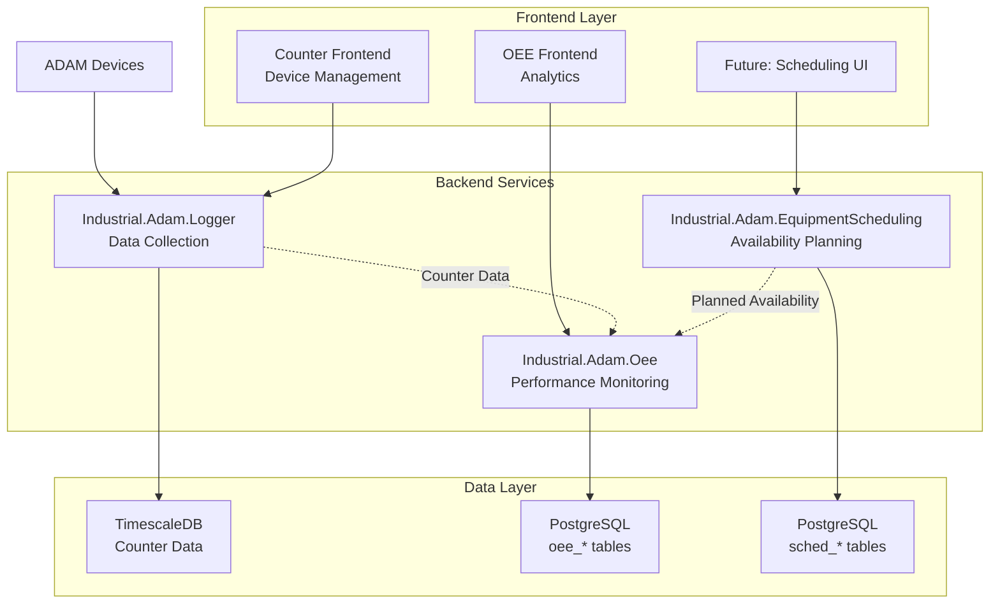

# Master Implementation Plan: OEE Cleanup & Equipment Scheduling System

**Version:** 2.0 (Simplified - No Production Constraints)  
**Date:** 2025-01-19  
**Status:** Ready for Execution

## Executive Summary

This master plan consolidates all implementation documentation for:
1. **OEE Module Cleanup** - Remove Phase 3 over-implementations
2. **Equipment Scheduling System** - Create new business module  
3. **System Integration** - Connect all components properly

Since nothing is in production, we can take an aggressive, clean approach with no migration concerns.

---

## 1. Complete System Architecture

### Current State

```
Industrial ADAM Ecosystem
├── Industrial.Adam.Logger (✅ Foundation - No Changes)
│   ├── Device communication with ADAM hardware
│   ├── Counter data collection and storage
│   └── REST API for data queries
│
├── Frontend Applications (✅ Working - No Changes)
│   ├── /adam-counter-frontend (Port 3000) - Device management UI
│   └── /oee-app/oee-interface (Port 3001) - Manufacturing analytics UI
│
├── Industrial.Adam.Oee (🔧 Requires Cleanup)
│   ├── ❌ Batch tracking (remove)
│   ├── ❌ Wrong shift concept (remove)
│   ├── ❌ Complex scheduling (remove)
│   ├── ❌ Over-engineered canonical (remove)
│   └── ✅ Core OEE monitoring (keep & simplify)
│
└── Industrial.Adam.EquipmentScheduling (🆕 To Create)
    ├── ISA-95 equipment hierarchy
    ├── Operating patterns (24/7, Two-Shift, etc.)
    └── Schedule generation & API
```

### Target Architecture



### Data Flow

```
ADAM Devices → Logger → TimescaleDB → OEE Analytics
                              ↓
                    Equipment Scheduling → Planned Availability
```

---

## 2. Implementation Strategy (4 Weeks Total)

### Week 1: OEE Cleanup ✂️

**Goal:** Remove all Phase 3 over-implementations, simplify to core monitoring

#### Files to Delete
```bash
# Run the cleanup script
./scripts/cleanup-phase3.sh

# Removes:
- Domain/Entities/Batch.cs
- Domain/Entities/Shift.cs  
- Domain/Entities/JobSchedule.cs
- Domain/Entities/QualityInspection.cs
- Domain/ValueObjects/CanonicalReference.cs
- Domain/ValueObjects/TransactionLog.cs
- Domain/ValueObjects/StateTransition.cs
- Infrastructure/Data/Migrations/006-*.sql
- Infrastructure/Data/Migrations/007-*.sql
```

#### Simple Replacements to Create
```csharp
// SimpleJobQueue.cs - Basic FIFO job management
public class SimpleJobQueue : Entity<int>
{
    public string LineId { get; private set; }
    public Queue<QueuedJob> Jobs { get; private set; }
    
    public void AddJob(string workOrderId, int priority = 0);
    public QueuedJob GetNextJob();
}

// BasicQualityTracking.cs - Simple good/scrap counts
public class QualityRecord : Entity<int>
{
    public string WorkOrderId { get; private set; }
    public int GoodCount { get; private set; }
    public int ScrapCount { get; private set; }
    public decimal QualityRate => GoodCount / (decimal)(GoodCount + ScrapCount);
}
```

### Week 2-3: Equipment Scheduling Foundation 🏗️

**Goal:** Create new module with ISA-95 hierarchy and operating patterns

#### Module Structure
```
src/Industrial.Adam.EquipmentScheduling/
├── Domain/
│   ├── Entities/
│   │   ├── Resource.cs              # ISA-95 hierarchy
│   │   ├── OperatingPattern.cs      # When equipment runs
│   │   └── PatternAssignment.cs     # Pattern to equipment mapping
│   └── Services/
│       └── ScheduleGenerationService.cs
├── Application/
│   ├── Commands/
│   └── Queries/
├── Infrastructure/
│   └── Data/
│       └── Migrations/
│           └── 001-create-scheduling-tables.sql
└── WebApi/
    └── Controllers/
        └── AvailabilityController.cs
```

#### Core Database Schema
```sql
-- Equipment hierarchy (ISA-95)
CREATE TABLE sched_resources (
    id BIGSERIAL PRIMARY KEY,
    name VARCHAR(200) NOT NULL,
    code VARCHAR(50) UNIQUE,
    resource_type VARCHAR(20), -- Enterprise, Site, Area, WorkCenter, WorkUnit
    parent_id BIGINT REFERENCES sched_resources(id),
    hierarchy_path VARCHAR(500),
    requires_scheduling BOOLEAN DEFAULT FALSE
);

-- Operating patterns
CREATE TABLE sched_operating_patterns (
    id SERIAL PRIMARY KEY,
    name VARCHAR(100) NOT NULL,
    pattern_type VARCHAR(20), -- Continuous, TwoShift, DayOnly, Extended, Custom
    configuration JSONB NOT NULL
);

-- Generated schedules
CREATE TABLE sched_equipment_schedules (
    id BIGSERIAL PRIMARY KEY,
    resource_id BIGINT REFERENCES sched_resources(id),
    schedule_date DATE NOT NULL,
    planned_hours DECIMAL(4,2),
    schedule_status VARCHAR(20)
);
```

### Week 4: Integration 🔌

**Goal:** Connect OEE with Equipment Scheduling for complete solution

#### Integration Points
```csharp
// OEE queries Equipment Scheduling for planned availability
public interface IEquipmentAvailabilityService
{
    Task<bool> IsPlannedOperatingAsync(string lineId, DateTime timestamp);
    Task<PlannedHours> GetPlannedHoursAsync(string lineId, DateTime date);
}

// OEE calculation using both Logger and Equipment Scheduling data
public class OeeCalculationService
{
    private readonly ICounterDataService _counterData;        // From Logger
    private readonly IEquipmentAvailabilityService _availability; // From Equipment Scheduling
    
    public async Task<OeeMetrics> CalculateAsync(string lineId, DateTime date)
    {
        var actual = await _counterData.GetProductionDataAsync(lineId, date);
        var planned = await _availability.GetPlannedHoursAsync(lineId, date);
        
        return new OeeMetrics
        {
            Availability = actual.RunTime / planned.TotalHours,
            Performance = actual.ActualOutput / actual.TheoreticalOutput,
            Quality = actual.GoodCount / actual.TotalCount,
            OEE = Availability * Performance * Quality
        };
    }
}
```

---

## 3. GitHub Strategy

### Branch Plan
```
main
├── feature/oee-cleanup           # Week 1: Remove over-implementations
├── feature/equipment-scheduling  # Week 2-3: New module
└── feature/integration          # Week 4: Connect modules
```

### Pull Request Sequence

#### PR #1: OEE Cleanup
```yaml
Title: "refactor: Remove Phase 3 over-implementations from OEE"
Description: |
  - Remove batch tracking, wrong shift concept, complex scheduling
  - Simplify to core OEE monitoring
  - Add simple job queue and quality tracking
Files Changed: ~50 files
Review Time: 2 hours
```

#### PR #2: Equipment Scheduling Foundation  
```yaml
Title: "feat: Add Equipment Scheduling System foundation"
Description: |
  - Create new Industrial.Adam.EquipmentScheduling module
  - Add ISA-95 equipment hierarchy
  - Implement basic operating patterns
  - Add API for availability queries
Files Changed: ~30 new files
Review Time: 3 hours
```

#### PR #3: Integration
```yaml
Title: "feat: Integrate OEE with Equipment Scheduling"  
Description: |
  - Add IEquipmentAvailabilityService interface
  - Update OEE calculations to use planned availability
  - Add integration tests
Files Changed: ~10 files
Review Time: 1 hour
```

---

## 4. Risk Mitigation

### Low Risk Approach
- ✅ No production data to migrate
- ✅ No backwards compatibility concerns  
- ✅ Clean deletion of wrong code
- ✅ Fresh implementation of new features
- ✅ Comprehensive testing at each phase

### Validation Checkpoints
1. **After Week 1:** All Phase 1 & 2 OEE tests pass
2. **After Week 3:** Equipment Scheduling API responds correctly
3. **After Week 4:** End-to-end OEE calculation works with planned availability

---

## 5. Success Criteria

### Week 1 Success
- [ ] All Phase 3 files deleted
- [ ] OEE module compiles and tests pass
- [ ] Simple job queue working
- [ ] Basic quality tracking functional

### Week 2-3 Success  
- [ ] Equipment Scheduling module created
- [ ] ISA-95 hierarchy implemented
- [ ] Basic patterns (24/7, Two-Shift) working
- [ ] API endpoints responding

### Week 4 Success
- [ ] OEE consumes planned availability
- [ ] Complete OEE calculation working
- [ ] Integration tests passing
- [ ] Documentation updated

---

## 6. Quick Reference

### Commands
```bash
# Week 1: Cleanup
git checkout -b feature/oee-cleanup
./scripts/cleanup-phase3.sh
dotnet build
dotnet test

# Week 2-3: New Module
git checkout -b feature/equipment-scheduling
dotnet new classlib -n Industrial.Adam.EquipmentScheduling
# ... implement ...

# Week 4: Integration
git checkout -b feature/integration
# ... integrate ...
```

### Key Decisions
- **No migration needed** - Nothing in production
- **Aggressive cleanup** - Delete wrong implementations completely
- **Clean architecture** - Each module has clear boundaries
- **Simple integration** - REST API between modules

---

## Appendix: Document Archive

Previous detailed plans archived for reference:
- `/archive/master-implementation-timeline.md` - Original 16-week plan
- `/archive/oee-simplification-plan.md` - Detailed cleanup analysis
- `/archive/equipment-scheduling-foundation-plan.md` - Full 8-week roadmap
- `/archive/complete-system-architecture.md` - Comprehensive architecture analysis

These documents contain valuable technical details but are superseded by this simplified master plan.