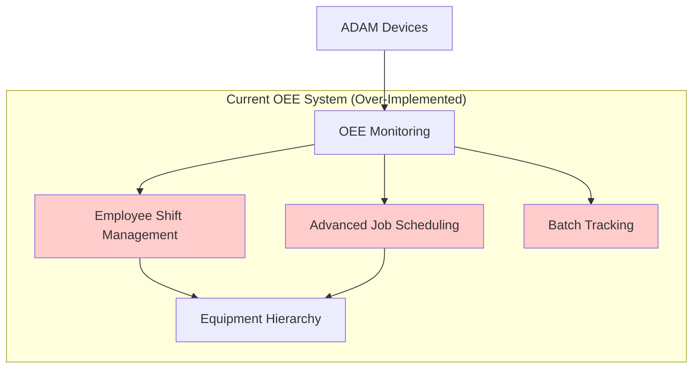
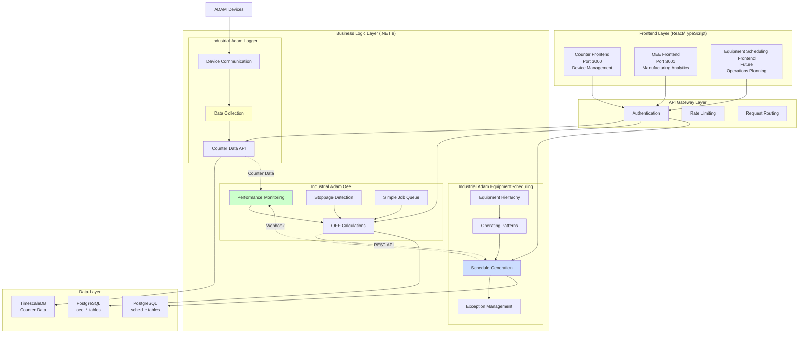

# Architectural Separation Plan: OEE Monitoring vs Equipment Scheduling System

**Document Version:** 1.0  
**Date:** 2024-08-18  
**Status:** Draft for Review  

## Executive Summary

This document outlines the architectural separation of the current over-implemented OEE system into two distinct, well-bounded modules: **OEE Monitoring** and **Equipment Scheduling System**. The current implementation has exceeded Phase 1 scope by implementing Phase 3 features that belong in a separate business system.

### Key Problems Identified

1. **Wrong "Shift" Implementation**: Current Shift.cs implements employee shift management, but the roadmap requires equipment operating patterns
2. **Job Scheduling Over-Implementation**: Complex scheduling logic belongs in Equipment Scheduling System, not OEE monitoring
3. **Batch Tracking Out of Scope**: Material genealogy is not needed in either system for the defined use cases
4. **Canonical Over-Engineering**: Complex patterns implemented where simple alignment with Equipment Scheduling API suffices

### Strategic Benefits

- **Clear Business Boundaries**: Each system serves distinct user groups and business needs
- **Scalable Architecture**: Equipment Scheduling System supports the full 8-week roadmap independently
- **Zero Rework Investment**: Preserve ISA-95 hierarchy work and valuable domain modeling
- **API-First Integration**: Clean contract between systems enables independent deployment
- **Future-Proof Design**: Architecture supports Equipment Scheduling as a standalone business opportunity

## 1. Current vs Proposed Architecture

### Current Architecture Problems



**Issues:**
- Employee shift management doesn't align with equipment operating patterns
- Advanced scheduling belongs in separate business system
- Batch tracking adds complexity without business value
- Mixed concerns create maintenance burden

### Proposed Complete System Architecture



**Complete System Overview:**

### Current System Components

1. **Industrial.Adam.Logger** (Foundation Layer)
   - **Purpose**: Device communication and data collection
   - **Responsibilities**: ADAM device protocol, counter data ingestion, TimescaleDB storage
   - **API**: REST endpoints for counter data queries
   - **Users**: System integrators, maintenance teams

2. **Frontend Applications** (React/TypeScript)
   - **Counter Frontend** (`/adam-counter-frontend`): Device management, configuration, health monitoring
   - **OEE Frontend** (`/oee-app/oee-interface`): Manufacturing analytics, job management, OEE dashboards
   - **Separation Strategy**: Different user personas require specialized interfaces

3. **Industrial.Adam.Oee** (Current - To Be Simplified)
   - **Current State**: Over-implemented with batch tracking, wrong shift concepts, complex scheduling
   - **Target State**: Focus on performance monitoring, stoppage detection, simple job queues
   - **Integration**: Consumes counter data from Logger, planned availability from Equipment Scheduling

4. **Industrial.Adam.EquipmentScheduling** (Future Module)
   - **Purpose**: Define when equipment should operate
   - **Scope**: ISA-95 hierarchy, operating patterns, schedule generation
   - **Business Value**: Standalone revenue stream for equipment availability planning

### Data Flow Architecture

```
ADAM Devices → Logger → TimescaleDB → OEE Analytics
                    ↓
            Equipment Scheduling → Planned Availability → OEE Calculations
```

**Benefits:**
- **Industrial.Adam.Logger** provides foundational data collection for all modules
- **Dual Frontend Strategy** serves distinct user personas effectively
- **Clean separation** of data collection, monitoring, and planning concerns
- **API-based integration** enables independent development and deployment
- Independent scaling and deployment
- Aligned with business domain boundaries

## 2. Module Boundaries & Responsibilities

### OEE Monitoring Module (Simplified)

**Purpose:** Monitor actual equipment performance vs planned availability

**Core Entities:**
- `EquipmentLine` - Production equipment being monitored
- `WorkOrder` - Simple production jobs (no complex scheduling)
- `Stoppage` - Downtime events with reasons
- `SimpleJobQueue` - Basic job tracking (not complex scheduling)

**Data Sources:**
- ADAM devices (actual production data)
- Equipment Scheduling System API (planned availability)

**Key Users:**
- Operators (real-time monitoring)
- Supervisors (performance reports) 
- Maintenance teams (downtime analysis)

**Responsibilities:**
```
✅ Real-time performance monitoring
✅ Stoppage detection and classification
✅ OEE calculations (Availability × Performance × Quality)
✅ Performance analytics and reporting
✅ Problem escalation workflows

❌ Equipment hierarchy management (use Equipment Scheduling API)
❌ Complex job scheduling algorithms
❌ Employee shift management  
❌ Material batch tracking
```

### Equipment Scheduling System (Future Module)

**Purpose:** Define when equipment should operate (planned availability patterns)

**Core Entities:**
- `Resource` (ISA-95 hierarchy) - Equipment hierarchy
- `OperatingPattern` - When equipment operates (Day/Night/Weekend patterns)
- `EquipmentSchedule` - Generated availability schedules
- `Exception` - Maintenance windows, holidays

**Data Consumers:**
- OEE systems (via REST API)
- MES systems
- Maintenance systems

**Key Users:**
- Operations managers (schedule planning)
- Industrial engineers (pattern optimization)
- System administrators (hierarchy management)

**Responsibilities:**
```
✅ ISA-95 equipment hierarchy management
✅ Operating pattern definition and management  
✅ Schedule generation with holiday/exception handling
✅ Equipment availability API for OEE systems
✅ Pattern inheritance and override logic

❌ Actual production monitoring
❌ Real-time performance calculations
❌ Employee work schedules (equipment patterns ≠ employee shifts)
```

## 3. Database Schema Plan

### Shared TimescaleDB Strategy

**Database Organization:**
- Single TimescaleDB instance
- Module-prefixed tables: `oee_*` and `sched_*`
- Foreign keys allowed between modules
- Optimized for both real-time monitoring and schedule generation

### OEE Module Tables (`oee_*`)

```sql
-- Core OEE monitoring tables
oee_equipment_lines      -- Equipment being monitored
oee_work_orders         -- Simple production jobs  
oee_stoppages          -- Downtime events
oee_performance_data   -- Real-time metrics (TimescaleDB hypertable)
oee_calculations       -- OEE calculation results
```

### Equipment Scheduling Tables (`sched_*`)

```sql
-- Equipment hierarchy and patterns
sched_resources           -- ISA-95 equipment hierarchy
sched_operating_patterns  -- Equipment operating patterns  
sched_equipment_schedules -- Generated availability (TimescaleDB hypertable)
sched_exceptions         -- Maintenance windows, holidays
sched_calendars          -- Holiday calendars by region
```

### Migration Strategy

**Phase 1: Prepare Separation**
1. Create `sched_*` tables alongside existing `oee_*` tables
2. Implement Equipment Scheduling API endpoints
3. Migrate ISA-95 hierarchy from OEE domain to Equipment Scheduling
4. Create data sync jobs between modules

**Phase 2: Cut Over OEE Module** 
1. Simplify OEE entities (remove complex scheduling)
2. Replace internal scheduling with Equipment Scheduling API calls
3. Remove employee shift management completely
4. Remove batch tracking tables and logic

**Phase 3: Equipment Scheduling Go-Live**
1. Activate Equipment Scheduling System UI
2. Train operations managers on new system
3. Migrate pattern definitions from old system
4. Enable webhook notifications to OEE systems

## 4. API Integration Specifications

### Equipment Scheduling → OEE Integration

**Primary API Endpoint:**
```
GET /api/v1/equipment/{equipmentId}/availability
```

**Request:**
```json
{
  "equipmentId": "LINE-001",
  "startDate": "2024-08-18",
  "endDate": "2024-08-25",
  "includeExceptions": true
}
```

**Response:**
```json
{
  "success": true,
  "data": {
    "equipmentId": "LINE-001",
    "equipmentName": "Production Line 001",
    "availability": [
      {
        "date": "2024-08-18",
        "shiftCode": "D",
        "plannedStartTime": "2024-08-18T06:00:00Z",
        "plannedEndTime": "2024-08-18T14:00:00Z", 
        "plannedHours": 8.0,
        "scheduleStatus": "Operating",
        "patternId": "DAY-SHIFT-PATTERN"
      }
    ]
  }
}
```

**Webhook Notification (Schedule Changes):**
```json
{
  "eventType": "schedule.updated",
  "equipmentId": "LINE-001", 
  "effectiveDate": "2024-08-19",
  "changedBy": "operations.manager",
  "changeReason": "Maintenance window added"
}
```

### Integration Patterns

**1. Pull Pattern (Primary):**
- OEE system queries Equipment Scheduling API every 15 minutes
- Caches availability data for performance
- Handles API unavailability gracefully

**2. Push Pattern (Secondary):**  
- Equipment Scheduling sends webhooks on schedule changes
- OEE system updates cache immediately
- Provides real-time updates for critical changes

**3. Fallback Pattern:**
- If Equipment Scheduling API unavailable, use last known schedule
- OEE calculations continue with cached data
- Alert operators of potential data staleness

## 5. Implementation Phases

### Phase 0: Preparation (2 weeks)

**Goals:** Set up foundation for clean separation

**Tasks:**
- [ ] Set up CI/CD pipeline for both modules
- [ ] Implement telemetry and monitoring 
- [ ] Create Equipment Scheduling API contracts (OpenAPI spec)
- [ ] Set up shared TimescaleDB with `sched_*` tables
- [ ] Create feature flags for gradual rollout

**Success Criteria:**
- Both modules can deploy independently
- API contracts documented and agreed upon
- Database schema supports both modules
- Monitoring dashboards operational

### Phase 1: Equipment Scheduling System (6 weeks)

**Goals:** Build complete Equipment Scheduling System per existing roadmap

**Tasks:**
- [ ] Migrate ISA-95 hierarchy from OEE to Equipment Scheduling
- [ ] Implement operating pattern management 
- [ ] Build schedule generation engine
- [ ] Create Equipment Scheduling Web UI
- [ ] Implement availability API for OEE consumption
- [ ] Add webhook system for schedule change notifications

**Success Criteria:**
- Equipment Scheduling System fully operational
- Operations managers can define and manage equipment patterns
- API provides availability data to OEE system
- Schedule changes trigger notifications

### Phase 2: OEE System Simplification (4 weeks)

**Goals:** Remove over-implemented features from OEE system

**Tasks:**
- [ ] Remove employee shift management (Shift.cs and related)
- [ ] Remove advanced job scheduling (AdvancedJobSchedulingService.cs)
- [ ] Remove batch tracking (Batch.cs and related)
- [ ] Simplify WorkOrder to basic job tracking
- [ ] Implement Equipment Scheduling API client
- [ ] Update OEE calculations to use external availability data

**Success Criteria:**
- OEE system focused purely on performance monitoring
- Complex scheduling logic removed
- Employee management removed
- System integrates cleanly with Equipment Scheduling API

### Phase 3: Integration & Testing (2 weeks)

**Goals:** Validate end-to-end integration between modules

**Tasks:**
- [ ] Integration testing between modules
- [ ] Performance testing under load
- [ ] Failover testing (API unavailable scenarios)
- [ ] User acceptance testing with operators and managers
- [ ] Documentation and training material updates

**Success Criteria:**
- All integration scenarios working correctly
- Performance targets met for both modules
- Users successfully trained on separated systems
- Documentation complete and accurate

### Phase 4: Production Rollout (2 weeks)

**Goals:** Deploy separated architecture to production

**Tasks:**
- [ ] Staged production deployment
- [ ] Monitor system health and performance
- [ ] Address any production issues
- [ ] Collect user feedback and address concerns
- [ ] Plan Phase 2 equipment scheduling feature activation

**Success Criteria:**
- Both modules stable in production
- No degradation in OEE monitoring capabilities
- Equipment Scheduling System ready for Phase 2 features
- Users satisfied with separated functionality

## 6. Risks & Mitigations

### Technical Risks

| Risk | Probability | Impact | Mitigation |
|------|------------|--------|------------|
| API integration failures | Medium | High | Comprehensive testing, fallback mechanisms, circuit breakers |
| Database performance degradation | Low | High | Indexing strategy, query optimization, monitoring |
| Data consistency issues between modules | Medium | Medium | Transaction boundaries, eventual consistency patterns |
| Complex domain migration errors | Medium | High | Gradual migration, parallel running, automated validation |

### Business Risks

| Risk | Probability | Impact | Mitigation |
|------|------------|--------|------------|
| User resistance to separated systems | Medium | Medium | Training, gradual rollout, clear communication of benefits |
| Temporary functionality gaps during migration | High | Low | Feature flags, parallel systems, rollback plans |
| Integration complexity delays | Medium | Medium | Agile approach, early integration testing |
| Equipment Scheduling adoption challenges | Low | Medium | User-centered design, operations manager involvement |

### Risk Mitigation Strategies

**1. Technical Risk Mitigation:**
```
- Implement comprehensive API monitoring and alerting
- Use circuit breaker patterns for external API calls  
- Create automated data consistency validation jobs
- Maintain parallel data during migration phases
- Implement graceful degradation for API unavailability
```

**2. Business Risk Mitigation:**
```
- Involve key users in design and testing phases
- Provide comprehensive training before go-live
- Maintain old functionality during transition period
- Create detailed rollback procedures
- Establish clear communication channels for issues
```

**3. Data Integrity Mitigation:**
```
- Implement audit logging for all data changes
- Create data validation rules at API boundaries  
- Use database constraints to prevent invalid states
- Implement automated backup and recovery procedures
- Create data reconciliation jobs between modules
```

## 7. Success Metrics

### OEE Module Success Metrics

**Technical Metrics:**
- API response time: < 200ms (95th percentile)
- System uptime: > 99.9%  
- Data processing lag: < 30 seconds
- Memory usage: < 2GB per instance

**Business Metrics:**
- OEE calculation accuracy: > 99.5%
- Stoppage detection latency: < 60 seconds
- User satisfaction: > 80% positive feedback
- Support tickets: < 10 per week

### Equipment Scheduling Module Success Metrics

**Technical Metrics:**
- Schedule generation time: < 5 seconds for 1000 equipment
- API availability: > 99.9%
- Pattern complexity support: Simple patterns (Phase 1)
- Database query performance: < 100ms average

**Business Metrics:**
- Schedule accuracy: > 99% match with planned vs actual
- User adoption: 100% operations managers using system
- Setup time: < 30 minutes for new equipment patterns
- Pattern modification time: < 5 minutes average

### Integration Success Metrics

**Technical Metrics:**
- API integration success rate: > 99.9%
- Webhook delivery success: > 99.5%
- Cache hit rate: > 90%
- Failover recovery time: < 5 minutes

**Business Metrics:**
- End-to-end workflow success: > 99%
- Data consistency: 100% between modules
- User workflow completion: < 10 minutes average
- Cross-module error rate: < 0.1%

## 8. Conclusion

This architectural separation plan transforms an over-implemented OEE system into two focused, well-bounded modules that align with their respective business domains. The separation:

**Preserves Investment:**
- ISA-95 hierarchy work moves to its natural home in Equipment Scheduling
- Valuable domain modeling and patterns are retained
- TimescaleDB and monitoring infrastructure continue to serve both modules

**Enables Future Growth:**
- Equipment Scheduling System can follow its full 8-week roadmap independently
- OEE system focuses on its core competency of performance monitoring
- Clean API boundaries support additional integrations

**Reduces Complexity:**
- Each module has clear, single responsibility
- Maintenance burden distributed appropriately
- Testing and deployment become more manageable

**Delivers Business Value:**
- Operations managers get dedicated equipment scheduling tools
- Operators get focused OEE monitoring without distractions
- Systems can scale and evolve independently

The phased approach ensures minimal disruption to current operations while positioning both systems for long-term success in their respective domains.

---

**Next Steps:**
1. Review this plan with engineering leadership
2. Get stakeholder approval for the phased approach  
3. Begin Phase 0 preparation activities
4. Establish project team and governance structure
5. Create detailed implementation backlogs for each phase

**Document Control:**
- **Author:** Claude Code (Architecture Agent)
- **Reviewers:** Engineering Leadership, Product Management
- **Approval Required:** Technical Architecture Board
- **Next Review:** 2024-08-25