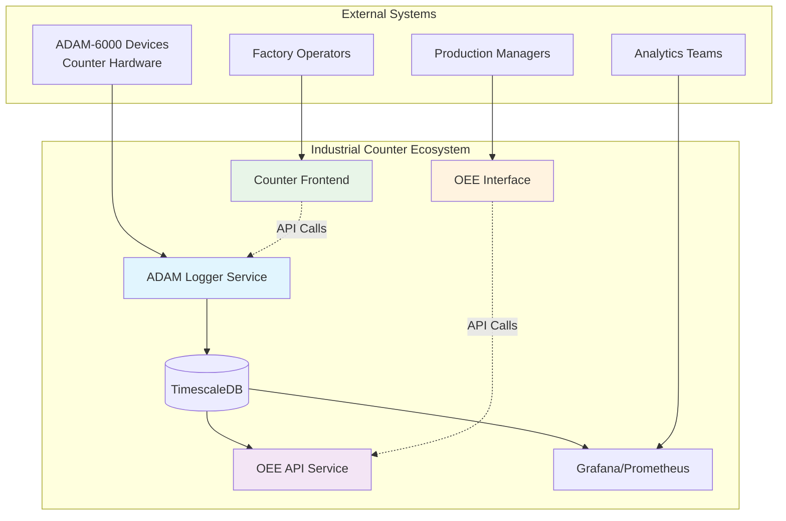
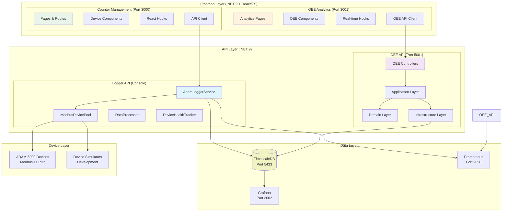
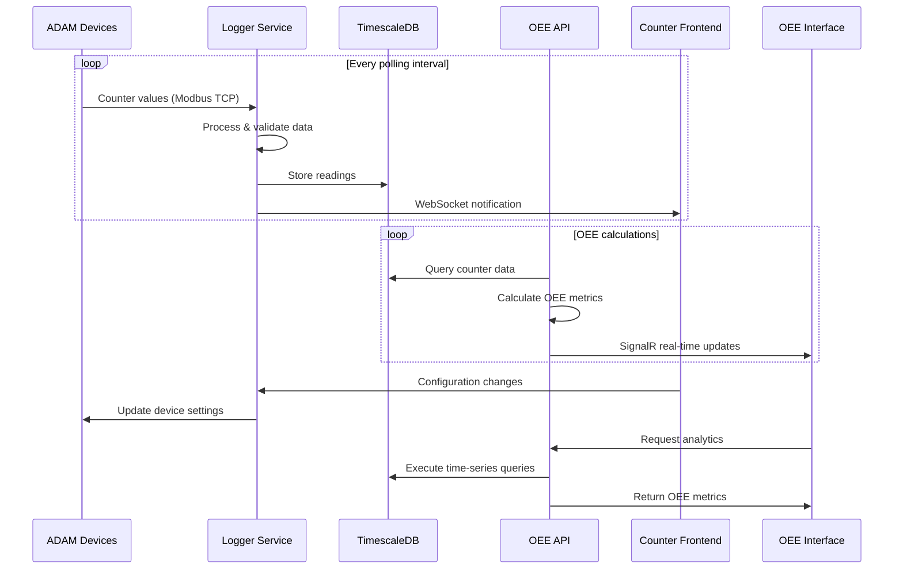
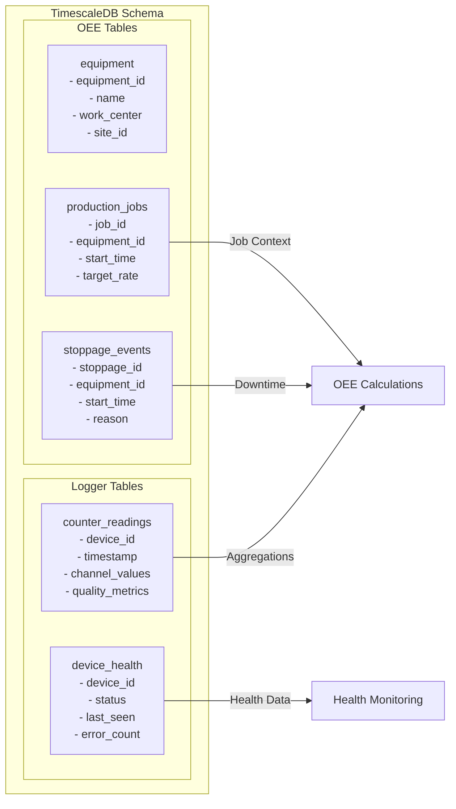
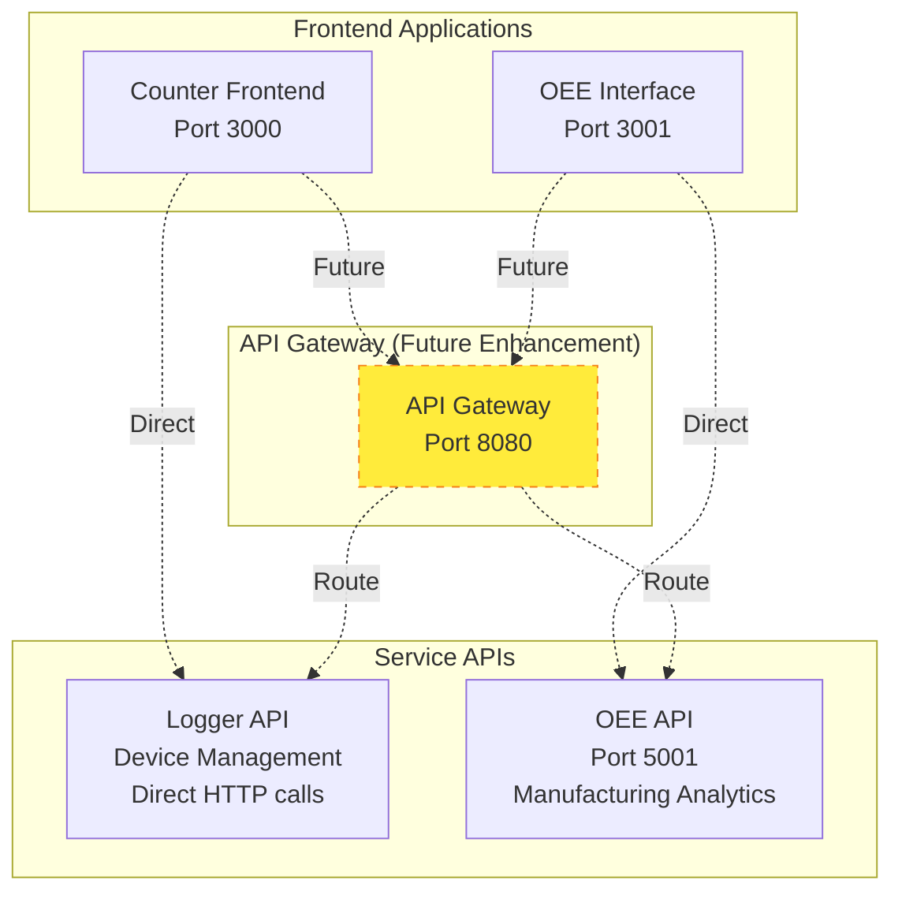
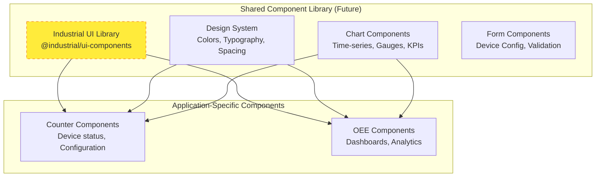
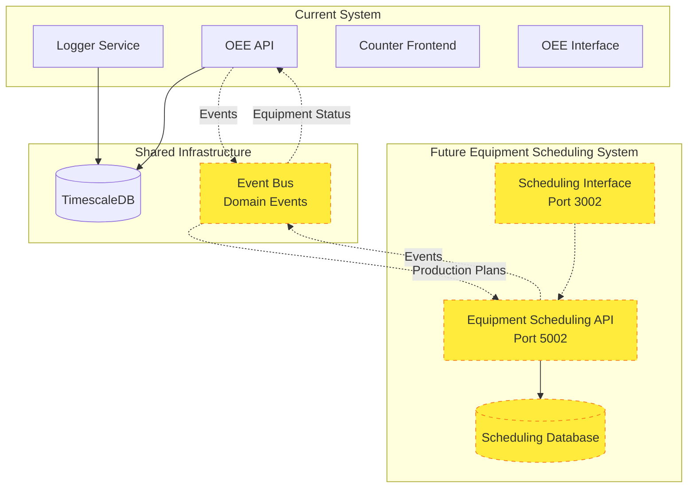

# Complete System Architecture Analysis

**Document Version:** 1.0  
**Date:** 2025-08-18  
**Status:** Comprehensive Analysis  

## Executive Summary

This document provides a complete architectural analysis of the Industrial ADAM Counter ecosystem, positioning all components within a clean, scalable architecture that supports both current capabilities and future expansion into Equipment Scheduling.

### Key Findings

1. **Foundation Layer**: Industrial.Adam.Logger serves as the foundational data collection system
2. **Dual Frontend Strategy**: Two specialized React applications serve distinct user needs
3. **Clean API Boundaries**: Well-defined separation between data collection and business logic
4. **Microservices Architecture**: Independent services with clear responsibilities
5. **Equipment Scheduling Ready**: Architecture supports seamless addition of scheduling functionality

### Strategic Recommendations

- **Maintain Current Architecture**: The existing separation is sound and scalable
- **Unified API Gateway**: Consider implementing for consolidated frontend access
- **Shared Component Library**: Standardize UI components across both React applications
- **Event-Driven Integration**: Implement domain events for loose coupling between services

## 1. Complete System Architecture

### 1.1 System Context Diagram



**Legend:**
- **Blue (LOGGER)**: Foundation data collection layer
- **Purple (OEE_API)**: Business logic and analytics layer  
- **Green (COUNTER_UI)**: Device management interface
- **Orange (OEE_UI)**: Manufacturing analytics interface

### 1.2 Component Architecture Diagram



## 2. Component Responsibility Matrix

### 2.1 Backend Services (.NET 9)

| Component | Primary Responsibility | Key Features | Dependencies |
|-----------|----------------------|--------------|--------------|
| **Industrial.Adam.Logger.Core** | Device data collection and storage | Modbus communication, real-time processing, TimescaleDB persistence | TimescaleDB, Modbus devices |
| **Industrial.Adam.Logger.WebApi** | HTTP API for device management | Device configuration, health monitoring, data access | Logger.Core |
| **Industrial.Adam.Oee.Domain** | OEE business rules and entities | Equipment hierarchy, availability calculations, performance metrics | None (pure domain) |
| **Industrial.Adam.Oee.Application** | OEE use cases and orchestration | CQRS commands/queries, validation, business workflows | Domain layer |
| **Industrial.Adam.Oee.Infrastructure** | OEE data access and external services | Repository pattern, TimescaleDB queries, SignalR hubs | Application layer |
| **Industrial.Adam.Oee.WebApi** | REST API for OEE functionality | Analytics endpoints, real-time notifications, CORS-enabled | All OEE layers |

### 2.2 Frontend Applications (React/TypeScript)

| Component | Primary Responsibility | Key Features | API Integration |
|-----------|----------------------|--------------|-----------------|
| **adam-counter-frontend** | Device management interface | Real-time monitoring, device configuration, diagnostics, health status | Logger WebApi, WebSocket |
| **oee-app/oee-interface** | Manufacturing analytics interface | OEE dashboards, performance analysis, stoppage tracking, reporting | OEE WebApi, SignalR |

### 2.3 Infrastructure Components

| Component | Primary Responsibility | Key Features | Integration |
|-----------|----------------------|--------------|-------------|
| **TimescaleDB** | Time-series data storage | Hypertables, continuous aggregates, data retention policies | Both Logger and OEE APIs |
| **Grafana** | Visualization and dashboards | Real-time charts, alerting, custom dashboards | TimescaleDB, Prometheus |
| **Prometheus** | Metrics collection and monitoring | Application metrics, alerts, service health | All .NET services |

## 3. Data Flow Architecture

### 3.1 Real-Time Data Flow



### 3.2 Data Storage Strategy



## 4. API Architecture Strategy

### 4.1 API Boundaries and Responsibilities



### 4.2 API Endpoint Organization

#### Logger API Endpoints
```
GET  /api/devices              # List all devices
GET  /api/devices/{id}         # Get device details
POST /api/devices/{id}/config  # Update device configuration
GET  /api/devices/{id}/health  # Get device health status
GET  /api/readings             # Get recent readings (with filtering)
WS   /ws/realtime             # WebSocket for real-time updates
```

#### OEE API Endpoints
```
GET  /api/equipment            # List equipment hierarchy
GET  /api/equipment/{id}/oee   # Get OEE metrics for equipment
GET  /api/production/jobs      # List production jobs
POST /api/stoppages            # Record stoppage events
GET  /api/analytics/dashboard  # Dashboard metrics
SignalR /stoppageHub          # Real-time stoppage notifications
```

## 5. Frontend Strategy Recommendations

### 5.1 Unified vs. Specialized Approach

**Current Strategy: Specialized Applications (Recommended)**

| Aspect | Counter Frontend | OEE Interface | Rationale |
|--------|------------------|---------------|-----------|
| **User Persona** | Technicians, Operators | Managers, Analysts | Different information needs |
| **Primary Focus** | Device health, configuration | Performance metrics, analytics | Different mental models |
| **Update Frequency** | Real-time monitoring | Dashboard refresh cycles | Different UX patterns |
| **Technology Stack** | Next.js 15, React 19, TypeScript | Next.js 15, React 19, TypeScript | Consistent but optimized |

### 5.2 Shared Component Strategy



## 6. Equipment Scheduling Integration Strategy

### 6.1 Future Architecture with Equipment Scheduling



### 6.2 Integration Patterns

| Integration Pattern | Use Case | Implementation |
|-------------------|----------|----------------|
| **Event-Driven Messaging** | Equipment status changes, production completions | Domain events via MediatR, message bus |
| **API Composition** | Cross-system dashboards | API Gateway pattern, GraphQL federation |
| **Shared Read Models** | Reporting and analytics | Materialized views in TimescaleDB |
| **Database Per Service** | Service autonomy | Separate databases with eventual consistency |

## 7. Implementation Recommendations

### 7.1 Short-Term Improvements (Next 30 Days)

1. **API Documentation**
   - Complete OpenAPI specifications for both services
   - Add API versioning strategy
   - Implement consistent error response formats

2. **Frontend Optimization**
   - Implement shared TypeScript types between frontend and backend
   - Add comprehensive error boundaries
   - Optimize WebSocket/SignalR connection management

3. **Monitoring Enhancement**
   - Add application-level metrics to Prometheus
   - Create comprehensive Grafana dashboards
   - Implement health check endpoints

### 7.2 Medium-Term Architecture (Next 90 Days)

1. **API Gateway Implementation**
   - Evaluate Ocelot, YARP, or cloud-native solutions
   - Implement authentication/authorization layer
   - Add rate limiting and caching

2. **Shared Component Library**
   - Extract common UI components
   - Implement design system
   - Create Storybook for component documentation

3. **Event-Driven Architecture**
   - Implement domain events in OEE service
   - Add message broker (RabbitMQ, Azure Service Bus)
   - Create event sourcing for critical business events

### 7.3 Long-Term Evolution (Next 6 Months)

1. **Equipment Scheduling Integration**
   - Design scheduling domain model
   - Implement scheduling API service
   - Create scheduling frontend interface

2. **Advanced Analytics**
   - Implement machine learning models for predictive maintenance
   - Add advanced OEE forecasting
   - Create automated reporting system

3. **Scalability Improvements**
   - Container orchestration (Kubernetes)
   - Database sharding/partitioning strategy
   - Microservices observability stack

## 8. Technology Stack Summary

### 8.1 Current Technology Matrix

| Layer | Technology | Version | Purpose |
|-------|------------|---------|---------|
| **Backend Framework** | .NET | 9.0 | Core application platform |
| **Web API** | ASP.NET Core | 9.0 | REST API services |
| **Database** | TimescaleDB | 2.17.2 | Time-series data storage |
| **ORM** | Entity Framework Core | 9.0 | Data access layer |
| **Frontend Framework** | Next.js | 15.2.4 | React application framework |
| **UI Library** | React | 19.0 | User interface components |
| **Language** | TypeScript | 5.0 | Type-safe JavaScript |
| **CSS Framework** | Tailwind CSS | 3.4 | Utility-first styling |
| **Component Library** | Radix UI | Various | Accessible UI primitives |
| **Real-time** | SignalR/WebSocket | - | Live data updates |
| **Containerization** | Docker | - | Application deployment |
| **Orchestration** | Docker Compose | - | Multi-container management |
| **Monitoring** | Grafana + Prometheus | 12.0.2 + 2.47.0 | Observability stack |

### 8.2 Architecture Patterns in Use

- **Clean Architecture**: Domain-driven design with clear layer separation
- **CQRS**: Command Query Responsibility Segregation in OEE service
- **Repository Pattern**: Data access abstraction
- **Dependency Injection**: Inversion of control throughout
- **Options Pattern**: Configuration management
- **Mediator Pattern**: Request/response handling in application layer

## Conclusion

The current Industrial ADAM Counter ecosystem demonstrates a well-architected, scalable system with clear separation of concerns. The dual frontend strategy effectively serves different user personas, while the backend services maintain clean API boundaries and responsibilities.

**Key Strengths:**
- Solid foundation with the Logger service as the data collection layer
- Clean separation between device management and analytics interfaces
- Modern technology stack with excellent performance characteristics
- Extensible architecture ready for Equipment Scheduling integration

**Recommended Next Steps:**
1. Complete API documentation and implement versioning
2. Create shared component library for frontend consistency
3. Implement API Gateway for unified access patterns
4. Begin Equipment Scheduling service design and integration planning

This architecture provides a robust foundation for both current operations and future expansion into comprehensive manufacturing execution system capabilities.