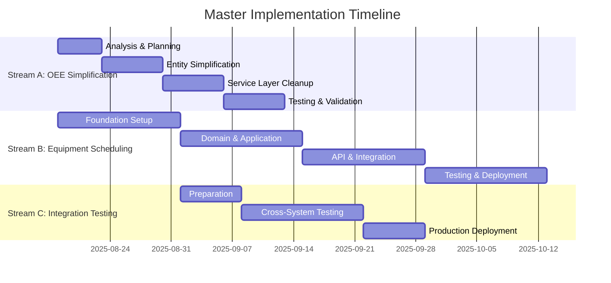

# Master Implementation Timeline & Resource Allocation Plan

**Document Version:** 1.0  
**Date:** 2025-08-18  
**Status:** Draft for Review  
**Total Duration:** 16 weeks (4 months)  

## Executive Summary

This master timeline coordinates three parallel work streams to achieve architectural separation while maintaining zero downtime and preparing for business growth opportunities:

- **Stream A**: OEE Simplification (4 weeks) - Remove over-implementations and return to core monitoring
- **Stream B**: Equipment Scheduling Foundation (8 weeks) - Build new standalone business system
- **Stream C**: Integration & Testing (4 weeks, overlapping) - Connect systems and validate end-to-end flows

### Strategic Objectives
1. **Maintain Business Continuity**: Zero downtime for current OEE operations
2. **Enable Business Growth**: Equipment Scheduling System as standalone opportunity
3. **Technical Excellence**: Clean architecture, maintainable code, proper separation of concerns
4. **Risk Management**: Phased approach with decision points and rollback capabilities

## 1. Master Timeline Overview (16 Weeks)

### High-Level Phases



### Critical Dependencies

| Dependency | Blocker For | Risk Level | Mitigation |
|------------|-------------|------------|------------|
| TimescaleDB schema coordination | Both A & B streams | High | Shared schema review gate at Week 2 |
| OEE API simplification | Integration testing | Medium | API contract freeze at Week 4 |
| Equipment Scheduling API readiness | OEE integration | High | Mock API available Week 6 |
| Database migration rollback | OEE production stability | High | Complete rollback testing Week 3 |

## 2. Weekly Detailed Breakdown

### Week 1 (Aug 18-24): Foundation & Analysis
**Focus**: Preparation and risk mitigation setup

#### Stream A: OEE Simplification - Analysis Phase
**Team**: 1 Senior Developer + 1 Database Admin (40% time)
- [ ] **Day 1-2**: Complete dependency mapping for all Phase 3 entities
- [ ] **Day 3**: Create comprehensive database backup and rollback procedures  
- [ ] **Day 4-5**: Detailed impact assessment of API endpoint removals
- [ ] **Deliverable**: Risk-assessed simplification plan with rollback procedures

#### Stream B: Equipment Scheduling - Project Setup
**Team**: 1 Lead Developer + 1 Developer (100% time)
- [ ] **Day 1-2**: Create project structure and CI/CD pipeline setup
- [ ] **Day 3-4**: TimescaleDB complete schema design (Phase 1 + Phase 2 tables)
- [ ] **Day 5**: Domain entity design and basic architecture validation
- [ ] **Deliverable**: Equipment Scheduling project foundation ready

#### Stream C: Integration - Preparation
**Team**: 1 Integration Specialist (50% time)
- [ ] **Day 1-3**: API contract definition between OEE and Equipment Scheduling
- [ ] **Day 4-5**: Integration testing environment setup
- [ ] **Deliverable**: Integration testing framework ready

**Weekly Gate**: Architecture review with technical leadership

---

### Week 2 (Aug 25-31): Core Development Begins
**Focus**: Begin parallel development streams

#### Stream A: OEE Simplification - Entity Removal
**Team**: 1 Senior Developer + 1 Developer (80% time)
- [ ] **Day 1-2**: Remove Batch.cs, JobSchedule.cs, Shift.cs completely
- [ ] **Day 3-4**: Simplify WorkOrder.cs (remove Phase 3 properties/methods)
- [ ] **Day 5**: Create SimpleJobQueue.cs and QualityRecord.cs replacements
- [ ] **Deliverable**: Simplified entity layer with new simple replacements

#### Stream B: Equipment Scheduling - Domain Layer
**Team**: 1 Lead Developer + 1 Developer (100% time)
- [ ] **Day 1-2**: Implement Resource.cs with ISA-95 hierarchy support
- [ ] **Day 3-4**: Implement OperatingPattern.cs and PatternAssignment.cs
- [ ] **Day 5**: Create domain services for pattern inheritance and schedule generation
- [ ] **Deliverable**: Complete domain layer with business logic

#### Stream C: Integration - Mock Services
**Team**: 1 Integration Specialist (75% time)
- [ ] **Day 1-3**: Create mock Equipment Scheduling API for OEE testing
- [ ] **Day 4-5**: Initial integration test scenarios design
- [ ] **Deliverable**: Mock services ready for OEE integration testing

**Weekly Gate**: Domain model review and schema approval

---

### Week 3 (Sep 1-7): Service Layer & Database
**Focus**: Service implementation and database operations

#### Stream A: OEE Simplification - Service Cleanup
**Team**: 1 Senior Developer + 1 Developer (100% time)
- [ ] **Day 1-2**: Remove BatchManagementService, AdvancedJobSchedulingService
- [ ] **Day 3-4**: Update remaining services to use simplified entities
- [ ] **Day 5**: Implement IEquipmentAvailabilityService interface
- [ ] **Deliverable**: Simplified service layer ready for testing

#### Stream B: Equipment Scheduling - Application Layer
**Team**: 1 Lead Developer + 1 Developer + 0.5 Database Admin (100% time)
- [ ] **Day 1-2**: Implement CQRS commands and queries with MediatR
- [ ] **Day 3-4**: Create EF Core DbContext and repository implementations
- [ ] **Day 5**: Execute complete TimescaleDB schema creation
- [ ] **Deliverable**: Application layer complete with database connectivity

#### Stream C: Integration - Database Coordination
**Team**: 1 Database Admin + 1 Integration Specialist (75% time)
- [ ] **Day 1-3**: Coordinate schema changes between OEE and Equipment Scheduling
- [ ] **Day 4-5**: Test database rollback procedures for OEE simplification
- [ ] **Deliverable**: Database migration strategy validated

**Weekly Gate**: Service layer review and database schema validation

---

### Week 4 (Sep 8-14): Infrastructure & API Development
**Focus**: Database migration execution and API development

#### Stream A: OEE Simplification - Database Migration
**Team**: 1 Database Admin + 1 Senior Developer (100% time)
- [ ] **Day 1**: Execute Phase 3 table rollback in development environment
- [ ] **Day 2-3**: Update repositories and remove Phase 3 data access code
- [ ] **Day 4-5**: Update API controllers, remove complex endpoints
- [ ] **Deliverable**: Database migration complete, APIs simplified

#### Stream B: Equipment Scheduling - RESTful APIs
**Team**: 1 Lead Developer + 1 API Developer (100% time)
- [ ] **Day 1-2**: Implement ResourcesController and PatternsController
- [ ] **Day 3-4**: Implement SchedulesController with availability endpoints
- [ ] **Day 5**: Add OpenAPI documentation and validation
- [ ] **Deliverable**: Complete RESTful API with OEE integration endpoints

#### Stream C: Integration - API Testing
**Team**: 1 Integration Specialist + 1 QA Engineer (50% time)
- [ ] **Day 1-3**: Test simplified OEE APIs
- [ ] **Day 4-5**: Test Equipment Scheduling availability APIs
- [ ] **Deliverable**: API integration scenarios validated

**Weekly Gate**: API contract freeze and integration readiness review

---

### Week 5 (Sep 15-21): Advanced Features & Background Services
**Focus**: Background processing and advanced system features

#### Stream A: OEE Simplification - Testing & Optimization
**Team**: 1 Senior Developer + 1 QA Engineer (75% time)
- [ ] **Day 1-2**: Unit test updates for simplified entities and services
- [ ] **Day 3-4**: Performance testing to ensure no degradation
- [ ] **Day 5**: Integration testing with Equipment Scheduling mock API
- [ ] **Deliverable**: Fully tested simplified OEE system

#### Stream B: Equipment Scheduling - Background Services
**Team**: 1 Lead Developer + 1 Infrastructure Developer (100% time)
- [ ] **Day 1-2**: Implement schedule generation background service
- [ ] **Day 3-4**: Add Redis caching for high-performance availability queries
- [ ] **Day 5**: Implement webhook notification system for schedule changes
- [ ] **Deliverable**: Production-ready background processing

#### Stream C: Integration - End-to-End Testing
**Team**: 1 Integration Specialist + 1 QA Engineer (100% time)
- [ ] **Day 1-3**: Replace mock services with real Equipment Scheduling APIs
- [ ] **Day 4-5**: End-to-end workflow testing (pattern assignment → OEE calculation)
- [ ] **Deliverable**: Validated end-to-end integration

**Weekly Gate**: System integration review and performance validation

---

### Week 6 (Sep 22-28): UI Development & Advanced Integration
**Focus**: User interface and advanced integration features

#### Stream A: OEE Simplification - Production Preparation
**Team**: 1 Senior Developer (50% time)
- [ ] **Day 1-2**: Final testing with real Equipment Scheduling API
- [ ] **Day 3-5**: Production deployment preparation and documentation
- [ ] **Deliverable**: OEE system ready for production deployment

#### Stream B: Equipment Scheduling - UI Development
**Team**: 1 Frontend Developer + 1 UX Designer + 1 Backend Developer (100% time)
- [ ] **Day 1-2**: Equipment hierarchy management UI
- [ ] **Day 3-4**: Operating pattern configuration UI  
- [ ] **Day 5**: Schedule visualization and exception management UI
- [ ] **Deliverable**: Complete Equipment Scheduling web interface

#### Stream C: Integration - Performance & Load Testing
**Team**: 1 Integration Specialist + 1 Performance Engineer (100% time)
- [ ] **Day 1-3**: Load testing for Equipment Scheduling availability APIs
- [ ] **Day 4-5**: Performance testing of complete integrated system
- [ ] **Deliverable**: Performance benchmarks and optimization recommendations

**Weekly Gate**: UI/UX review and performance acceptance

---

### Week 7 (Sep 29-Oct 5): User Testing & Documentation
**Focus**: User acceptance and comprehensive documentation

#### Stream A: OEE Simplification - User Training
**Team**: 1 Business Analyst + 1 Technical Writer (75% time)
- [ ] **Day 1-2**: User acceptance testing with operators and supervisors
- [ ] **Day 3-5**: Documentation updates and training material creation
- [ ] **Deliverable**: User-validated OEE system with complete documentation

#### Stream B: Equipment Scheduling - User Testing & Training
**Team**: 1 Business Analyst + 1 Frontend Developer + 1 Technical Writer (100% time)
- [ ] **Day 1-2**: User acceptance testing with operations managers
- [ ] **Day 3-4**: User training sessions and feedback incorporation
- [ ] **Day 5**: Final UI adjustments based on user feedback
- [ ] **Deliverable**: User-accepted Equipment Scheduling system

#### Stream C: Integration - Security & Compliance
**Team**: 1 Security Specialist + 1 Compliance Officer (100% time)
- [ ] **Day 1-3**: Security testing and vulnerability assessment
- [ ] **Day 4-5**: Compliance validation and audit trail verification
- [ ] **Deliverable**: Security and compliance validated system

**Weekly Gate**: User acceptance sign-off and security approval

---

### Week 8 (Oct 6-12): Pre-Production Testing
**Focus**: Final validation before production deployment

#### Stream A: OEE Simplification - Final Validation
**Team**: 1 Senior Developer + 1 QA Lead (100% time)
- [ ] **Day 1-2**: Production environment smoke testing
- [ ] **Day 3-4**: Rollback procedure validation
- [ ] **Day 5**: Final go/no-go decision preparation
- [ ] **Deliverable**: Production-ready OEE system with validated rollback

#### Stream B: Equipment Scheduling - Production Readiness
**Team**: 1 Lead Developer + 1 Infrastructure Engineer (100% time)
- [ ] **Day 1-2**: Production environment setup and configuration
- [ ] **Day 3-4**: Database performance tuning and optimization
- [ ] **Day 5**: Production deployment rehearsal
- [ ] **Deliverable**: Production-ready Equipment Scheduling system

#### Stream C: Integration - Deployment Orchestration
**Team**: 1 DevOps Engineer + 1 Integration Specialist (100% time)
- [ ] **Day 1-3**: Deployment orchestration and rollback procedures
- [ ] **Day 4-5**: Final integration testing in production-like environment
- [ ] **Deliverable**: Orchestrated deployment plan with monitoring

**Weekly Gate**: Production readiness review and deployment approval

---

### Week 9 (Oct 13-19): Production Deployment Phase 1
**Focus**: Equipment Scheduling System go-live

#### All Streams: Coordinated Deployment
**Team**: Full deployment team (6 people, 100% time)
- [ ] **Day 1**: Equipment Scheduling System production deployment
- [ ] **Day 2-3**: Initial production monitoring and issue resolution
- [ ] **Day 4-5**: User onboarding and initial production usage
- [ ] **Deliverable**: Equipment Scheduling System live in production

**Weekly Gate**: Phase 1 go-live success validation

---

### Week 10 (Oct 20-26): Production Deployment Phase 2
**Focus**: OEE System simplification go-live

#### All Streams: OEE Cutover
**Team**: Full deployment team (6 people, 100% time)
- [ ] **Day 1**: OEE system simplification deployment
- [ ] **Day 2-3**: Integration validation in production
- [ ] **Day 4-5**: User training on integrated system
- [ ] **Deliverable**: Complete integrated system live in production

**Weekly Gate**: Phase 2 go-live success validation

---

### Weeks 11-12 (Oct 27-Nov 9): Production Monitoring & Optimization
**Focus**: System stabilization and performance optimization

#### Stream A+B: Production Support
**Team**: 3-4 people, 75% time
- [ ] Monitor system performance and user adoption
- [ ] Address production issues and optimization opportunities
- [ ] Collect user feedback and plan improvements
- [ ] **Deliverable**: Stable production system with optimization roadmap

---

### Weeks 13-16 (Nov 10-Dec 7): Handoff & Future Planning
**Focus**: Knowledge transfer and future roadmap

#### All Streams: Project Closeout
**Team**: 2-3 people, 50% time
- [ ] **Week 13-14**: Complete documentation and knowledge transfer
- [ ] **Week 15-16**: Future roadmap planning and team transition
- [ ] **Deliverable**: Complete project handoff with future roadmap

## 3. Resource Allocation Matrix

### Core Team Structure

| Role | Stream A | Stream B | Stream C | Total FTE |
|------|----------|----------|----------|-----------|
| **Technical Lead** | 20% | 60% | 20% | 1.0 |
| **Senior Developer** | 80% | - | 20% | 1.0 |
| **Backend Developer** | 40% | 100% | - | 1.4 |
| **Frontend Developer** | - | 80% | 20% | 1.0 |
| **Database Admin** | 40% | 30% | 30% | 1.0 |
| **Integration Specialist** | 20% | 20% | 100% | 1.4 |
| **QA Engineer** | 60% | 40% | 100% | 2.0 |
| **DevOps Engineer** | 20% | 40% | 40% | 1.0 |
| **Business Analyst** | 40% | 60% | - | 1.0 |
| **Technical Writer** | 30% | 70% | - | 1.0 |

**Total Resource Requirement**: ~11.8 FTE across 16 weeks

### Skill Requirements & Training Needs

#### Critical Skills Required
- **TimescaleDB Administration**: 1 expert, 2 intermediate level
- **Clean Architecture & CQRS**: 3 developers with experience
- **React/TypeScript**: 2 frontend developers
- **Industrial Systems Integration**: 2 specialists with manufacturing domain knowledge
- **Performance Testing**: 1 specialist for high-throughput scenarios

#### Training Requirements
- **ISA-95 Standards**: 2-day training for 4 team members (Week 1)
- **Equipment Scheduling Domain**: 1-day training for all developers (Week 2)
- **TimescaleDB Optimization**: 3-day training for database team (Week 3)
- **OEE Business Process**: 1-day training for new team members (Week 1)

## 4. Work Stream Coordination Matrix

### Parallel Work Dependencies

| Week | Stream A Output | Stream B Input | Stream C Coordination |
|------|-----------------|----------------|----------------------|
| 1 | API contract changes | - | Integration test planning |
| 2 | Simplified entities | Domain model alignment | Mock service development |
| 3 | Service interfaces | Service layer design | Database coordination |
| 4 | Database schema changes | TimescaleDB setup | Migration validation |
| 5 | Testing results | Background services | Integration testing |
| 6 | Production readiness | UI development | Performance testing |
| 7 | User acceptance | User testing | Security validation |
| 8 | Final validation | Production readiness | Deployment orchestration |

### Communication Protocols

#### Daily Standups
- **Time**: 9:00 AM EST
- **Duration**: 15 minutes per stream, 5 minutes cross-stream
- **Focus**: Dependencies, blockers, handoffs

#### Weekly Cross-Stream Reviews
- **Time**: Friday 3:00 PM EST
- **Duration**: 60 minutes
- **Attendees**: Stream leads + technical lead + product owner
- **Focus**: Dependency resolution, risk assessment, next week planning

#### Critical Decision Points
- **Week 2**: Schema approval and API contracts freeze
- **Week 4**: Integration approach final validation
- **Week 6**: Production deployment approach approval
- **Week 8**: Go/no-go decision for production deployment
- **Week 10**: Complete system integration validation

## 5. Risk Management Timeline

### High-Risk Periods

#### Week 3-4: Database Migration Critical Period
**Risks**: 
- Data loss during Phase 3 table rollback
- Schema conflicts between OEE and Equipment Scheduling
- Performance degradation

**Mitigations**:
- Complete database backup before any changes
- Parallel database testing environment
- Database rollback procedures tested and validated
- Performance benchmarking before/after changes

#### Week 8-10: Production Deployment Window
**Risks**:
- Integration failures in production
- User adoption resistance
- Performance issues under load

**Mitigations**:
- Comprehensive production-like testing environment
- Blue-green deployment strategy
- User training completed before go-live
- Rollback procedures tested and documented
- 24/7 support team during deployment weeks

### Risk Escalation Process

| Risk Level | Response Time | Escalation Path | Decision Authority |
|------------|---------------|-----------------|-------------------|
| **Low** | 24 hours | Stream Lead | Stream Lead |
| **Medium** | 4 hours | Technical Lead | Technical Lead + Product Owner |
| **High** | 1 hour | Project Sponsor | Executive Sponsor |
| **Critical** | 30 minutes | Executive Team | CTO + Business Sponsor |

### Rollback Decision Points

#### Week 4: OEE Database Migration
- **Trigger**: >10% performance degradation or data integrity issues
- **Rollback Time**: 2 hours
- **Impact**: 1-week delay to Stream A

#### Week 9: Equipment Scheduling Go-Live
- **Trigger**: System unavailable >4 hours or >5% error rate
- **Rollback Time**: 4 hours
- **Impact**: 2-week delay to full integration

#### Week 10: Complete System Integration
- **Trigger**: Integration failure rate >1% or user-blocking issues
- **Rollback Time**: 6 hours
- **Impact**: Return to Stream A-only operation, 4-week delay

## 6. Production Deployment Strategy

### Deployment Approach: Blue-Green with Canary

#### Phase 1: Equipment Scheduling System (Week 9)
1. **Blue Environment**: New Equipment Scheduling System
2. **Green Environment**: Continue current OEE-only operation
3. **Canary**: 10% of equipment hierarchy for initial testing
4. **Full Cutover**: After 48 hours of successful canary operation

#### Phase 2: OEE System Integration (Week 10)
1. **Blue Environment**: Integrated system (simplified OEE + Equipment Scheduling)
2. **Green Environment**: Previous state (OEE + new Equipment Scheduling)
3. **Canary**: 20% of production lines for initial testing
4. **Full Cutover**: After 72 hours of successful canary operation

### Monitoring & Validation

#### Technical Metrics (Automated)
- API response times: < 200ms (95th percentile)
- System availability: > 99.9%
- Database query performance: < 100ms average
- Integration success rate: > 99.5%

#### Business Metrics (Manual + Automated)
- OEE calculation accuracy: > 99.5% vs previous system
- Equipment availability data accuracy: > 99%
- User workflow completion rate: > 95%
- Support ticket volume: < 5 per day for first month

#### Success Criteria Gates
- **24-hour gate**: Technical metrics within targets
- **72-hour gate**: Business metrics validated
- **1-week gate**: User satisfaction > 80%
- **1-month gate**: System stability demonstrated

## 7. Budget & Cost Analysis

### Development Costs

| Category | Resource | Duration | Cost Estimate |
|----------|----------|----------|---------------|
| **Personnel** | 11.8 FTE × 16 weeks | 188.8 person-weeks | $565,000 |
| **Infrastructure** | Testing environments, tools | 16 weeks | $35,000 |
| **Training** | Team training programs | 10 training days | $15,000 |
| **External Consultants** | Performance testing, security | 2 weeks | $25,000 |
| **Contingency** | Risk mitigation (10%) | - | $64,000 |
| **Total Estimated Cost** | | | **$704,000** |

### Cost-Benefit Analysis

#### Benefits (Annual)
- **Reduced Maintenance**: Simplified architecture saves 20% maintenance effort = $120,000/year
- **New Business Opportunity**: Equipment Scheduling as standalone product = $500,000/year potential
- **Improved Performance**: Better system performance reduces support costs = $50,000/year
- **Developer Productivity**: Cleaner codebase improves velocity by 15% = $85,000/year

#### ROI Calculation
- **Investment**: $704,000 (one-time)
- **Annual Benefits**: $755,000/year  
- **Payback Period**: 11 months
- **3-Year NPV** (10% discount): $1,170,000

## 8. Success Metrics & KPIs

### Technical Success Metrics

#### System Performance
- **OEE Calculation Speed**: < 100ms per equipment line (current: 150ms)
- **Equipment Availability Query**: < 50ms response time (new capability)
- **Database Query Performance**: < 100ms average across all operations
- **Memory Usage**: < 2GB per service instance
- **CPU Usage**: < 70% under normal load

#### System Reliability  
- **Uptime**: > 99.9% (excluding planned maintenance)
- **Integration Success Rate**: > 99.5% OEE ↔ Equipment Scheduling calls
- **Data Consistency**: 100% between OEE and Equipment Scheduling
- **Error Rate**: < 0.1% across all operations
- **Recovery Time**: < 5 minutes for any component failure

### Business Success Metrics

#### User Experience
- **User Satisfaction**: > 80% positive feedback (survey-based)
- **Task Completion Rate**: > 95% for common workflows
- **User Adoption**: 100% operations managers using Equipment Scheduling within 30 days
- **Training Effectiveness**: < 30 minutes to complete basic tasks after training
- **Support Ticket Volume**: < 10 per week after initial 30 days

#### Operational Efficiency
- **OEE Accuracy**: > 99.5% vs manual calculations
- **Schedule Accuracy**: > 99% planned vs actual availability
- **Setup Time**: < 30 minutes to configure new equipment patterns
- **Response Time**: < 60 seconds for stoppage detection and notification
- **Data Freshness**: < 30 seconds lag for real-time metrics

### Quality Metrics

#### Code Quality
- **Test Coverage**: > 85% for both systems
- **Code Complexity**: Cyclomatic complexity < 10 per method
- **Technical Debt**: < 20 hours of identified technical debt
- **Documentation Coverage**: 100% public APIs documented
- **Security Vulnerabilities**: Zero high/critical vulnerabilities

#### Architecture Quality
- **Dependency Violations**: Zero violations of clean architecture boundaries
- **API Consistency**: 100% compliance with REST API standards
- **Database Performance**: All queries < 100ms under load
- **Service Boundaries**: Clear separation between OEE and Equipment Scheduling
- **Integration Patterns**: Consistent error handling and retry logic

## 9. Contingency Planning

### Scenario Planning

#### Scenario 1: Database Migration Issues (Week 3-4)
**Probability**: Medium (30%)  
**Impact**: High - Could delay entire project  
**Response Plan**:
1. Immediately halt migration and restore from backup
2. Conduct detailed analysis of migration failure
3. Implement additional migration testing in isolated environment
4. Add 1-week buffer to timeline for migration rework
5. Consider alternative migration approach (gradual vs full cutover)

#### Scenario 2: Equipment Scheduling API Performance Issues (Week 5-6)
**Probability**: Medium (25%)  
**Impact**: Medium - Could affect integration quality  
**Response Plan**:
1. Implement advanced caching strategy (Redis)
2. Optimize database queries and indexing
3. Consider API response optimization (pagination, field selection)
4. Implement circuit breaker patterns for resilience
5. Add performance specialist to team if needed

#### Scenario 3: User Adoption Resistance (Week 7-8)
**Probability**: Low (15%)  
**Impact**: Medium - Could affect business value realization  
**Response Plan**:
1. Conduct additional user interviews to understand concerns
2. Implement requested UI/UX improvements  
3. Provide additional training and support
4. Create user champions program for peer support
5. Consider phased rollout approach for user adoption

#### Scenario 4: Integration Complexity Higher Than Expected (Week 4-6)
**Probability**: Medium (35%)  
**Impact**: High - Could affect timeline and quality  
**Response Plan**:
1. Simplify initial integration approach (reduce feature scope)
2. Implement integration in phases rather than big-bang
3. Add integration specialist resources
4. Focus on core integration scenarios first
5. Defer advanced integration features to post-launch

### Decision Trees

#### Week 4 Decision: Database Migration Success
```
Database Migration Attempt
├── Success (70%)
│   └── Continue with timeline
└── Failure (30%)
    ├── Minor Issues (20%)
    │   ├── 1-day delay acceptable → Fix and continue
    │   └── >1-day delay → Rollback and rework
    └── Major Issues (10%)
        └── Full rollback required → Add 1-week buffer
```

#### Week 8 Decision: Production Deployment Readiness
```
Production Readiness Assessment
├── Fully Ready (60%)
│   └── Proceed with planned deployment
├── Minor Issues (30%)
│   ├── Can be resolved in 2 days → Proceed with delay
│   └── Requires >2 days → Delay by 1 week
└── Major Issues (10%)
    └── Defer deployment and reassess in 2 weeks
```

## 10. Conclusion & Next Steps

This master implementation timeline provides a comprehensive, risk-managed approach to coordinating the architectural separation while maintaining business continuity and enabling future growth. The plan balances aggressive timelines with practical risk management, ensuring successful delivery of both the simplified OEE system and the new Equipment Scheduling System foundation.

### Key Success Factors

1. **Strong Cross-Stream Coordination**: Daily standups and weekly cross-stream reviews ensure dependencies are managed effectively
2. **Risk-First Approach**: Identified high-risk periods have specific mitigation strategies and rollback procedures
3. **User-Centric Validation**: User acceptance testing and training are integrated throughout, not afterthoughts
4. **Technical Excellence**: Code quality, performance, and architectural integrity maintained throughout
5. **Business Value Focus**: Each phase delivers measurable business value while building toward larger strategic objectives

### Critical Dependencies for Success

1. **Team Availability**: 11.8 FTE commitment for 16 weeks requires dedicated team members
2. **Technical Leadership**: Strong technical lead to coordinate across streams and make architectural decisions
3. **Business Stakeholder Engagement**: Operations managers and equipment operators must be available for user testing and feedback
4. **Infrastructure Support**: Database administration and DevOps support critical during deployment phases
5. **Executive Support**: Clear executive sponsorship for decisions and resource allocation

### Immediate Actions Required

1. **Team Assembly**: Confirm team assignments and availability by Week 1 Day 1
2. **Environment Setup**: Ensure testing and development environments ready by Week 1 Day 3
3. **Stakeholder Communication**: Brief all stakeholders on timeline, expectations, and their required involvement
4. **Risk Assessment**: Conduct detailed risk assessment workshop with technical leadership
5. **Go/No-Go Decision**: Final decision on timeline and resource commitment by Week 1 Day 5

This plan provides the structure and coordination needed to successfully deliver the architectural separation while maintaining the high quality standards defined in the project's CLAUDE.md guidelines. The phased approach with clear decision points and rollback procedures ensures that business continuity is maintained while enabling future growth opportunities through the Equipment Scheduling System foundation.

---

**Document Control:**  
- **Author:** Claude Code (Architecture Agent)
- **Reviewers:** Technical Leadership, Product Management, Operations Management
- **Approval Required:** Executive Sponsor, Technical Architecture Board
- **Next Review:** Weekly during implementation, major review at Week 4 and Week 8